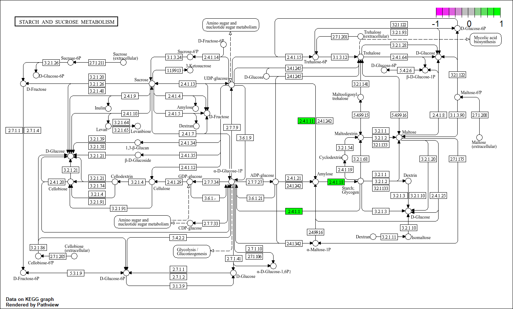

> *Please click on the images for a bigger view!*

# Load libraries
```{r, warning = FALSE, message = FALSE}
library(pathview)
library(tidyverse)
library(readxl)
library(DEP)
library(SummarizedExperiment)
library(org.Hs.eg.db)
library(AnnotationDbi)
library(clusterProfiler)
library(limma)
library(ggrepel)
library(ggplot2)
```


# Introduction
The article we have been assigned is "[Bile proteome reveals biliary regeneration during normothermic preservation of human donor livers](https://www.nature.com/articles/s41467-023-43368-y)" (@thorne2023bile). Individually we have read the article and divided the tasks. My tasks include:

- Primary analysis of data
- Normalisation & imputation of data
- Differential expression analysis
- Pathway analysis

I ended up only working with the `proteomics data`, as the transcriptomics data proved to be of insufficient quality. The proteomics data consists of bile samples taken from **extended criteria donors** (ECD), taken at three different time points after starting **normothermic machine perfusion** (NMP), at 30 and 150 minutes for the livers that end up not being transplanted (due to insufficient quality) and at 30, 150 minutes and before transplantation (timepoint: "end") for livers that did end up being transplanted. We will only work with the 30/150 minute samples as the 'end' timepoints consist of less samples and could skew the data as presumably only livers with higher quality get transplanted.

One of the traits that can be used to determine whether an ECD liver is suited for transplantation, is the "`biliary viability`". This tells something on the quality of '**cholangiocytes**', which are epethilial cells of the bile ducts. Higher biliary viability meaning the ECD liver is less likely to develop post-transplantation conditions such as cholangiopathy. A problem with this approach is that there are no set measurements for biliary viability, the way it gets measured varies per institute and consists of mostly physiological factors such as bile pH. 

Our goal is to get a better understanding of biomarker profiles in low/high biliary ECD livers and we hope to achieve this through a variety of methods including a **differential expression analysis (DEA), principal component analysis (PCA), Partial Least Squares Discriminant Analysis (PLS-DA) and a confusion matrix**.

Our research question is: "`What bile- and liver- biomarkers correlate with biliary viability of ECD livers?`"

# Loading data
For proteomics, we have various data files, including:

- `NMP_Bile_Proteomics_Report.txt` (.tsv): contains identified + quantified protein counts, rows = proteins, columns = sample ID.
- `supp_data.xlsx`, figure 3a: contains metadata, including sample ID, liver number and time point the sample was taken at.
- `supp_data.xlsx`, figure 4a: contains metadata, including sample ID, liver number and biliary viability.

By joining figure 3a/4a together from *supp_data.xlsx*, the required metadata for our research question can be retrieved.

```{r}
# Load count data from .txt file
data <- read.delim("../../../NMP_Bile_Proteomics_Report.txt", header = TRUE)

# Loading figure 3a + 4a from the supp_data excel file
sup_data1 <- read_excel("../../../supp_data.xlsx", sheet = "Figure 3a", col_names = TRUE, skip = 4, trim_ws = TRUE) # skip lines so the empty excel lines are not left in

sup_data2 <- read_excel("../../../supp_data.xlsx", sheet = "Figure 4a", col_names = TRUE, skip = 3, trim_ws = TRUE) # skip lines so the empty excel lines are not left in
```


## Creating metadata dataframe
```{r}
# Retain only the columns containing metadata
sample_id1 <- sup_data1[c("Sample", "Liver number", "Timepoint")]

sample_id2 <- sup_data2[c("Sample", "Biliary viability score group", "Total BDI score group", "Transplant")]
```

Next both dataframes are merged by the common 'Sample'-column, only the samples are kept that are in both dataframes (by using `inner_join`). sample_id1 seems to contain more samples than sample_id2, so it is expected the resulting merged dataframe will contain as many rows as sample_id2, assuming all of the samples of sample_id2 are also in sample_id1.

```{r}
print(paste("Amount of samples in sample_id1:", length(rownames(sample_id1))))
print(paste("Amount of samples in sample_id2:", length(rownames(sample_id2))))

# Only merges when sample ID is in both dataframes, leaves some livers out as there seems to be some missing data
merged_sample_id <- inner_join(sample_id1, sample_id2, by = "Sample")

print(paste("Amount of samples in merged dataframe:", length(rownames(merged_sample_id))))
```
**Conclusion**: 

- The resulting dataframe indeed contains as many rows as sample_id2, some samples have been lost due to their absence in sample_id2 and cannot be used as there is no biliary viability label for them, however 114 samples should be enough to proceed with our research.


## Data pre-processing

The colnames of the count data are very long (e.g."`X.2..NMP_Bile_Proteomics_171.raw.PG.Quantity`") and can be shortened using some regex, to make the names easier to work with, this is also needed because the sample names have to be the same as the format in the metadata (`NMP_Bile_Proteomics_171`), in order to filter on samples later on.

```{r}
colnames(data)[4:ncol(data)] <- sub(".*?(NMP_Bile_Proteomics_[0-9]+).*", "\\1", colnames(data)[4:ncol(data)]) # regex that removes everthing, but the "NMP_Bile_Proteomics_X" identifier and replaces colnames of data with this, we need that to match it to the metadata
```

In order to convert the data to a SummarizedExperiment-object (which is needed for imputation and comparing across groups), the data needs two columns: one with the gene names and one with a unique identifier that gets made with `make_unique`.
```{r}
# adds unique identifier columns based on name/id columns
data_unique <- make_unique(data, 
                           names = "PG.Genes", 
                           ids = "PG.ProteinAccessions", 
                           delim = ";")
```

### Filtering samples on timepoint

We will **only** be using 30/150min samples and these will be filtered in seperate dataframes as we will be comparing low vs high biliary viability in the 30 minute samples and in the 150 minute samples. **"End" samples are removed**.

**Filter 30 min samples**
```{r}
# Filter only the 30 min samples from metadata
samples_30min <- merged_sample_id$Sample[merged_sample_id$Timepoint == "30min"]

# Columns to keep in count data
cols_30min <- c("ID", "name", "PG.ProteinGroups", "PG.Genes","PG.ProteinAccessions", samples_30min)

# Subset on count data/metadata
samples_30min_data <- data_unique[, colnames(data_unique) %in% cols_30min]
samples_30min_metadata <- merged_sample_id[merged_sample_id$Sample %in% samples_30min, ]
```

**Now repeat for 150 min samples**
```{r}
# Filter only the 150 min samples from metadata
samples_150min <- merged_sample_id$Sample[merged_sample_id$Timepoint == "150min"]

# Columns to keep in count data
cols_150min <- c("ID", "name", "PG.ProteinGroups", "PG.Genes","PG.ProteinAccessions", samples_150min)

# Subset on count data/metadata
samples_150min_data <- data_unique[, colnames(data_unique) %in% cols_150min]
samples_150min_metadata <- merged_sample_id[merged_sample_id$Sample %in% samples_150min, ]
```

Replacing `NaN` values with `NA`, which is needed for further analysis
```{r}
# Convert NaN to NA, which is neccessary to create SE object and for normalisation
samples_30min_data <- samples_30min_data %>% mutate_all(~ifelse(is.nan(.), NA, .))
samples_150min_data <- samples_150min_data %>% mutate_all(~ifelse(is.nan(.), NA, .))
```

# Creating Summarized Experiment

A lot of R-packages for normalisation/imputation and differential expression analysis work with `SummarizedExperiment` objects, so I will be converting the data to that format. First an '**experimental design**' has to be made, containing information on sample ID, condition and replicate info. With the condition being the biliary viability. In our research there are **no replicates**.

**Making experimental design for 30 min**
```{r}
# Vector with sample column numbers
sample_columns_30min <- grep("NMP.", colnames(samples_30min_data))

experimental_design_30min <- data.frame(
  label = colnames(samples_30min_data[, sample_columns_30min]), # has to match colnames of samples 
  condition = samples_30min_metadata$`Biliary viability score group`,
  replicate = colnames(samples_30min_data[, sample_columns_30min]) # there are no replicates in this case, but they still need a unique identifier because duplicate rownames are not allowed
)
```

**Making experimental design for 150 min**
```{r}
# Vector with sample column numbers
sample_columns_150min <- grep("NMP.", colnames(samples_150min_data))

experimental_design_150min <- data.frame(
  label = colnames(samples_150min_data[, sample_columns_150min]),  #has to match colnames of samples 
  condition = samples_150min_metadata$`Biliary viability score group`,
  replicate = colnames(samples_150min_data[, sample_columns_150min]) # there are no replicates in this case, but they still need a unique identifier because duplicate rownames are not allowed
)

```

**Create summarized experiment**
```{r}
data_se_30min <- make_se(samples_30min_data, sample_columns_30min, experimental_design_30min)

data_se_150min <- make_se(samples_150min_data, sample_columns_150min, experimental_design_150min)
```


# Removing Samples/Proteins with high missing values
## Filtering samples with high missingness
```{r}
# Missing percentages per sample (column)
mean_missing_percentage_samples_30min <- colMeans(is.na(assay(data_se_30min))) * 100
mean_missing_percentage_samples_150min <- colMeans(is.na(assay(data_se_150min))) * 100

# Print mean missingness across samples
print(paste0("Mean percentage of 'missingness' across samples at 30 min: ", round(mean(mean_missing_percentage_samples_30min)), "%"),2)

print(paste0("Mean percentage of 'missingness' across samples at 150 min: ", round(mean(mean_missing_percentage_samples_150min)), "%"),2)
```

**Conclusion**: 

- The percentage of missing values across samples seems relatively high, `42% for 30 min samples` and `56% for 150 min samples`.
- The missingness is higher for the 150 minute samples than for the 30 minute samples. 


Some samples and proteins have a **high percentage of missing values**, this can cause noise or skew the data, as these rows/columns will heavily depend on the imputed data (and not necessarily be a good reflection of reality), thus I will remove these rows/columns. **Any samples with over 70% of missing data will be removed**.

```{r}
# Define "bad" samples, with >70% missing values
bad_samples_30min <- names(mean_missing_percentage_samples_30min[mean_missing_percentage_samples_30min > 70])

bad_samples_150min <- names(mean_missing_percentage_samples_150min[mean_missing_percentage_samples_150min > 70])

# Remove bad samples
data_se_30min <- data_se_30min[, !colnames(data_se_30min) %in% bad_samples_30min]
print(paste("Removed sample", bad_samples_30min, "from 30 min samples"))


data_se_150min <- data_se_150min[, !colnames(data_se_150min) %in% bad_samples_150min]
print(paste("Removed sample", bad_samples_150min, "from 150 min samples"))

```

Below the new missingness percentages are calculated.
```{r}
mean_missing_percentage_samples_30min_new <- colMeans(is.na(assay(data_se_30min))) * 100
mean_missing_percentage_samples_150min_new <- colMeans(is.na(assay(data_se_150min))) * 100

print(paste0("Mean percentage of 'missingness' across samples at 30 min: ", round(mean(mean_missing_percentage_samples_30min_new)), "%"),2)

print(paste0("Mean percentage of 'missingness' across samples at 150 min: ", round(mean(mean_missing_percentage_samples_150min_new)), "%"),2)
```

**Conclusion:**

-  It seems removing the 'bad' samples did **not** have a big impact on the overall missingness across samples. **The missingness in both 30 min and 150 min only went down by 1%**.

## Filtering proteins with high missingness

Here all proteins that have **more than 4 missing values in either of the conditions** (high/low biliary viability) are removed.

```{r}
# Keep all proteins with < 4 missing values total in each condition 
data_se_30min <- filter_proteins(data_se_30min, type = "condition", thr = 4)
data_se_150min <- filter_proteins(data_se_150min, type = "condition", thr = 4)
```

```{r}
# Calculate the median average presence of proteins per sample, in the article this was 41.5%
mean_protein_presence_30min <-  mean(rowMeans(!is.na(assay(data_se_30min)))) * 100
mean_protein_presence_30min

mean_protein_presence_150min <- mean(rowMeans(!is.na(assay(data_se_150min)))) * 100
mean_protein_presence_150min
```


# Normalizing data
## Normalizing across samples

For normalizing across samples, `median centering` is used.

```{r}
# Sample medians visibly differ from eachother, so median centering will have to be performed to remove noise between samples
plot_normalization(data_se_30min) + theme(axis.text.y = element_text(size = 6))
plot_normalization(data_se_150min) + theme(axis.text.y = element_text(size = 6))

```

**Conclusion:**

- The medians per sample across the 150 min and 30 min groups are **not** aligned, with all of them being skewed towards left or right in comparison to the adjecent samples.
- This points towards `high variance` across samples.

```{r}
median_centering <- function(data){
  # Calculate median per column
  colmed <- apply(assay(data), 2, median, na.rm = TRUE)
  
  # Remove sample median from all features, to centre data around median = 0, to correct for differences between samples
  med_normalized_samples <- sweep(assay(data), 2, colmed, "-")
  
  # Place sample-adjusted data back in summarized experiment
  assay(data) <- med_normalized_samples
  
  # Visualize data after sample normalizing
  plot_normalization(data) + theme(axis.text.y = element_text(size = 6))
}

median_centering(data_se_30min)
median_centering(data_se_150min)

```

**Conclusion:**

- All of the medians are now aligned across all samples in both the 30 min aswell as the 150 min groups, thus **median centering was succesfully performed**.
- Any noise present across the samples should now be minimized and downstream analysis will now lead to more accurate results.

## Normalizing across proteins

Normalisation across proteins will be done using `variance stabilizing transformation`, which uses a robust variant of the `maximum-likelihood estimator`. 

```{r}
# Visualizing row sd's versus row means, before normalizing across proteins
meanSdPlot(data_se_30min)
meanSdPlot(data_se_150min)
```

**Conclusion:**

- The red trend line shows the correlation between the standard deviation and the row means, the line follows a **downward slope** for both the 30min and 150min samples. Indicating that the standard deviation is lower, the higher the row means are and vice versa.
- The standard deviation seems to have **higher variance** for the 150 min samples than for the 30 min samples, with the red trend line starting at ~3.2 and ending at ~1.4 (and the 30 min sample line starting at ~2.2 and ending at ~1.3)


```{r}
# Normalize across proteins using variance stabilizing transformation
data_norm_30min <- normalize_vsn(data_se_30min)
data_norm_150min <- normalize_vsn(data_se_150min)
```

```{r}
# Visualizing again, after normalizing
meanSdPlot(data_norm_30min)
meanSdPlot(data_norm_150min)
```

**Conclusion:**

- The red trend line became more horizontal (as opposed to before normalization across proteins), showing a `more straight correlation` between standard deviation and row means.
- **Variance stabilizing transformation was succesfully performed** and any noise present across the proteins should now be minimized and downstream analysis will now lead to more accurate results.

```{r}
plot_frequency(data_norm_30min)
plot_frequency(data_norm_150min)
```

**Conclusion:** 

- **Most of the proteins are identified in all of the samples**, for 150 min samples this is n=41 and for 30 min samples this is n=43. 
- That proteins are identified in most samples means the results will be more reliable, as that means that for most proteins barely any imputation will have to take place (or none at all, in cases where proteins are identified in every sample). This means that there is less room for imputation to greatly alter/skew outcomes and offers an insight into results that strongly align with reality.

```{r}
plot_detect(data_norm_30min)
plot_detect(data_norm_150min)
```

**Conclusion**:

- Most missing values (blue line, or line that is left in the top graph) appear around `low log2 intensities`, in both the 30min samples and the 150min samples, this means that the signals of certain proteins are possibly too low for the device to be measured.
- These kind of missing values are called "**missing not at random**" (MNAR) and will have to be imputed for our further downstream analysis.

Imputation methods that seem to be most suited for imputation of MNAR values are: 

- quantile regression-based left-censored function (QRILC)
- MinDet
- MinProb

I have decided to choose `MinDet`, as this is a deterministic way of imputation, meaning the results are always the same, thus having high reproducibility. QRILC and MinProb are both stochastic and will vary slightly on each iteration. MinDet replaces all missing values with the lowest observed value in that sample.


# Imputation
```{r}
# Impute using MinDet, replace all missing values with lowest value per sample
data_imp_30min <- DEP::impute(data_norm_30min, fun="MinDet")
data_imp_150min <- DEP::impute(data_norm_150min, fun="MinDet")
```


```{r}
plot_imputation(data_norm_150min, data_imp_150min)
plot_imputation(data_norm_30min, data_imp_30min)
```

**Conclusion**:

- The effects of imputation are visible, after imputing, the missing values are filled with one or more "`peaks`" on the left side of the x-axis, containing the lowest-found values in that sample which have been used for imputation.
- **Imputation using MinDet has been succesfully performed**, the data now contains no NA values and attempts to accurately portray what those missing values should have been, using the minimal found values in the samples.

> **Keep in mind**: As opposed to **MNAR** values, "missing at random" or **MAR** values also exist, here the missing values are not caused by measurement device thresholds but occur at random. I have confirmed that our data consists mostly of MNAR missing values, but there are also MAR values (to a lesser extent). The chosen imputation method does not differentiate MAR values from MNAR values and also replaces them with the minimal found value, even though MAR values often occur at higher values. This is a choice I made based on the data being so left-centered that any "wrong" imputed MAR values will not have a significant impact on the end result, but still this should be kept in mind!

# Differential expression analysis

Now I will compare 2x2 groups to eachother:

- `High-biliary-viability-30min` vs `Low-biliary-viability-30min`
- `High-biliary-viability-150min` vs `Low-biliary-viability-150min`


```{r}
# Make a design using the conditions
design <- model.matrix(~ condition, data = colData(data_imp_150min))

# Function for differential expression analysis (DEA) with limma
limma_fit <- function(data){
  # high = intercept
  design <- model.matrix(~ condition, data = colData(data))
  
  # Fit linear model to each protein
  fit <- lmFit(assay(data), design)
  
  # Empirical Bayes smoothing
  fit <- eBayes(fit)
  
  # Apply false fiscovery rate correction
  limma_results <- topTable(fit, adjust.method = "fdr", number = Inf)
}

# Run on both timepoint datasets
limma_results_150min <- limma_fit(data_imp_150min)
limma_results_30min <- limma_fit(data_imp_30min)
```

Adding extra columns to data, for determining what proteins are down/upregulated (with `log2FC => 1.0 or =< -1.0`) and an `adjusted p-value of <= 0.05`.

```{r}
# Add a column of NAs
limma_results_30min$diffexpressed <- "NO"

# If log2Foldchange > 1.0 and pvalue < 0.05, set as "UP" 
limma_results_30min$diffexpressed[limma_results_30min$logFC >= 1.0 & limma_results_30min$adj.P.Val <= 0.05 & limma_results_30min$P.Value <
                                    limma_results_30min$adj.P.Val] <- "UP"

# If log2Foldchange < -1.0 and pvalue < 0.05, set as "DOWN"
limma_results_30min$diffexpressed[limma_results_30min$logFC <= -1.0 &limma_results_30min$adj.P.Val <= 0.05 & limma_results_30min$P.Value <
                                    limma_results_30min$adj.P.Val] <- "DOWN"

# Add protein label for volcanoplot if g
limma_results_30min$difflabel <- NA
limma_results_30min$difflabel[limma_results_30min$diffexpressed != "NO"] <-
  rownames(limma_results_30min)[limma_results_30min$diffexpressed != "NO"]


# Add a column of NAs
limma_results_150min$diffexpressed <- "NO"

# If log2Foldchange > 1.0 and pvalue < 0.05, set as "UP" 
limma_results_150min$diffexpressed[limma_results_150min$logFC >= 1.0 & limma_results_150min$adj.P.Val <= 0.05 & limma_results_150min$P.Value <
                                     limma_results_150min$adj.P.Val] <- "DOWN"

# If log2Foldchange < -1.0 and pvalue < 0.05, set as "DOWN"
limma_results_150min$diffexpressed[limma_results_150min$logFC <= -1.0 & limma_results_150min$adj.P.Val <= 0.05 & limma_results_150min$P.Value <
                                     limma_results_150min$adj.P.Val] <- "UP"

limma_results_150min$difflabel <- NA
limma_results_150min$difflabel[limma_results_150min$diffexpressed != "NO"] <-
  rownames(limma_results_150min)[limma_results_150min$diffexpressed != "NO"]
```

## Visualisation

Below the results from the DEA are made visible in a **volcanoplot**. The plot shows `logFC/p-value` for proteins, comparing high biliary vibility to low biliary viability, so if a protein is upregulated in the volcano plot, its upregulated in high biliary viability compared to low biliary viability.

```{r, warning=FALSE}
# Generate volcanoplot for 30 min results
ggplot(data = limma_results_30min, 
       aes(x = logFC, 
           y = - log10(adj.P.Val), 
           col = diffexpressed, 
           label = difflabel)) +
  
  geom_point() + 
  theme_minimal() +
  geom_text_repel() +
  scale_color_manual(values = c("blue", "black", "red")) +
  geom_vline(xintercept=c(-1.0, 1.0), col="black") +
  geom_hline(yintercept=-log10(0.05), col="black")

# Generate volcanoplot for 150 min results
ggplot(data = limma_results_150min, 
       aes(x = logFC, 
           y = - log10(adj.P.Val), 
           col = diffexpressed, 
           label = difflabel)) +
  
  geom_point() + 
  theme_minimal() +
  geom_text_repel() +
  scale_color_manual(values=c("blue", "black", "red")) +
  geom_vline(xintercept=c(-1.0, 1.0), col="black") +
  geom_hline(yintercept=-log10(0.05), col="black") +
  scale_x_reverse()
```

```{r}
# Make tables containing only downregulated or only upregulated genes
upregulated_150min <- limma_results_150min %>% filter(diffexpressed =="UP")
knitr::kable(upregulated_150min, format = "html")


downregulated_150min <- limma_results_150min %>% filter(diffexpressed =="DOWN")
knitr::kable(downregulated_150min, format = "html")
```


# Pathway Analysis
## Subset on significant DEP's

Next I will proceed with a pathway analysis of the found differentially enriched proteins, first we must subset on the DEP's with an adjusted p-value of 0.05 or below. I am only continuing with the 150 min samples because we established before that there are no significant DEP's in the 30 min samples.

```{r}
# Subset results for comparison, based on p-adjusted of 0.05 and/or below
diff_expressed_genes_150min <- limma_results_150min[!is.na (limma_results_150min$difflabel), ]
```

Next a dataframe has to be made that converts the `gene symbols` (abbreviations) to the `entrez ID's` (number), in order to continue with the pathway analysis.

```{r, message=FALSE}
# Create dataframe with corresponding entrez ID's for gene symbols
entrez_ID <- function(sig_df) {
  gene_names <- sig_df$difflabel
  genes_entrez <- AnnotationDbi::select(org.Hs.eg.db, keys = gene_names,
                                        columns = c('ENTREZID'), keytype = 'SYMBOL')
}

low_vs_high_150min_entrez <- entrez_ID(sig_df = diff_expressed_genes_150min)


knitr::kable(head(low_vs_high_150min_entrez), format = "html")

```

```{r, message=FALSE}
# Find all pathways that have one or more DEP
pathway_low_vs_high_150min <- enrichKEGG(gene = low_vs_high_150min_entrez$ENTREZID,
                                         organism = 'hsa')

# All pathways containing 1 or more DEP, retrieved from the results of pathway_low_vs_high_150min with '@result'
pathways <- pathway_low_vs_high_150min@result

# All significantly pathways (p.adj <= 0.05)
significant_pathways <- pathways %>% filter(p.adjust <= 0.05)


knitr::kable(significant_pathways, format = "html")

```

**Conclusion:**

- One significant pathway was found, [hsa00500](https://www.kegg.jp/pathway/hsa00500), which is a pathway that involves starch and sucrose metabolism. 
- The `Count` is 4, meaning 4 genes in this pathway are annotated and correspond with the found DEP's, EntrezID's are: 2632/5836/178/2998, which are the following genes: GBE1, PYGL, AGL and GYS2.
- The `RichFactor` is 0.1, which means that the found DEP's come from 10% of all genes in the pathway, meaning 10% of the genes are differentially regulated.
- The `FoldEnrichment` is 26.82, meaning that the frequency of all the annotated genes is 26.82x higher in the high biliary viability group than in the low biliary viability group.


```{r}
# Make dataframe that contains log fold change ($logFC)
low_vs_high_150min_FC <- diff_expressed_genes_150min$logFC

# Add entrez ids as rownames to dataframe
names(low_vs_high_150min_FC) <- low_vs_high_150min_entrez$ENTREZID

knitr::kable(as.data.frame(head(low_vs_high_150min_FC)), format = "html")
```

**Conclusion:**

- We now have a table that displays `entrezID + logfoldchange`, this will be used as data input for the pathview function.

## Visualisation using pathview
```{r, eval=FALSE}
# Create visualisations for each pathway with at least 1 DEG, eval=FALSE because this can generate a lot of visualisations, depending on the amount of pathways
dir.create("pathview_output")
setwd("pathview_output")

# Generate pathview visualisation for each significant pathway
for (pathway_id in rownames(significant_pathways)){
  print(paste("Processing pathway:", pathway_id))
  
  pathview(gene.data = low_vs_high_150min_FC, # chosen comparison
           pathway.id = pathway_id, # hsa ID
           species = "hsa", # human sapiens
           kegg.native = TRUE,
           low = list(gene="magenta"), # underexpressed = purple (colorblind friendly)
           high = list(gene="green"))  # overexpressed = green (colorblind friendly)
}

```

```{r, echo=FALSE}

```

**Conclusion:**

- The code above generates a pathview visualisation for each significant pathway (based on p-adj <= 0.05) that contains one or more significant DEP's (also based on based on p-adj <= 0.05). In this case that is only [hsa00500](https://www.kegg.jp/pathway/hsa00500), as all other pathways in this research are not significant.
- Three enzymes are highlighted green (upregulated) in the pathway:
  - 2.4.1.1: glycogen phosphorylase (PYGL) + glycogen debranching enzyme (AGL)
  - 2.4.1.11: glycogen synthase (GYS2)
  - 2.4.1.18:	1,4-alpha-glucan branching enzyme (GBE1)

# Generating table for research article

Minor changes are made to the table, such as adding significance and changing colnames, for the table to be better suited to put in our research article.

```{r}
# Adjust table for paper
# Add significance to values
diff_expressed_genes_150min$P.Value <- signif(diff_expressed_genes_150min$P.Value,3)
diff_expressed_genes_150min$t <- signif(diff_expressed_genes_150min$t,3)
diff_expressed_genes_150min$adj.P.Val <- formatC(diff_expressed_genes_150min$adj.P.Val,
                                                 format = "e",
                                                 digits = 2)
# Round values
diff_expressed_genes_150min$logFC <- round(diff_expressed_genes_150min$logFC,2)
diff_expressed_genes_150min$AveExpr <- round(diff_expressed_genes_150min$AveExpr,2)


diff_expressed_genes_150min$B <- round(diff_expressed_genes_150min$B,2)

# Order rows based on logFC
diff_expressed_genes_150min <-
  diff_expressed_genes_150min[order(diff_expressed_genes_150min$logFC),]

# Remove column that is not important to show in article
diff_expressed_genes_150min <- subset(diff_expressed_genes_150min, select = -difflabel)

colnames(diff_expressed_genes_150min) <- c("logFC", "Average Expression", "t", "p-value", "adjusted p-value", "B", "up/down regulated")

knitr::kable(diff_expressed_genes_150min, format = "html")

save(diff_expressed_genes_150min, file = "diff_expressed_genes_table_150min.Rdata")

```

