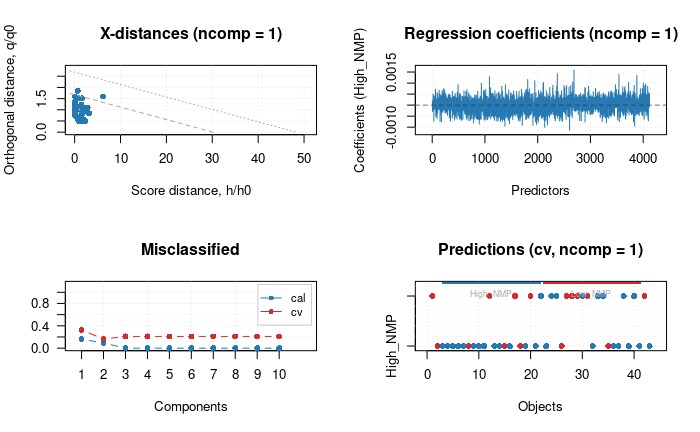

# Introduction

This is a logbook for the Omics liver transplant project. The goal of this project is to perform a PCA on both the proteomics data and RNA transcriptomics data, and find a link.

This logbook shows the proces of exploring data and processing this, applying different statistical principals like PLS-DA and PCA and some biological background on the results from these statistical principals. First the paper that the project will be based of has been read and needed to be understood completely before a research question was to be made. The paper that was chosen was the @thorne2023 paper and this paper talked about biliary regeneration during normothermic preservation of doner livers. This paper looked if ECD livers could be recoverd to a useable liver for tranplantation by putting them through and NMP machine that would suposedly kickstart the regeneration of the liver cells.

## Load libraries

```{r, include=FALSE}
library(tidyverse) # For data manipulation and visualization
library(ggplot2) # For data visualization
library(ggfortify) # For PCA visualization
library(factoextra) # For PCA visualization
library(Rsamtools) # For Reading Bam files
library(Rsubread) # Feature count
library(mdatools)

```

## Reading the Paper

The paper selected for this multi-omics project is the *Bile proteome reveals biliary regeneration during normothermic preservation of human donor livers* @thorne2023

The paper looks at the effects of NMP (Normothermic machine perfusion) on livers that are to be transplanted that may not be in the optimal shape, meaning they have high biliary injuries (Traumatic damage to the bile ducts) or lower biliary viality (a lower ammount of living cells). The research was conducted on 55 livers that were deemed suitable for transplantation analysis. The livers came from ECD (extended criteria donors) and DCD (donation after circulatory death) donors.

To analyse the livers a multitude of samples were taken. Before the NMP 46 bile duct biopsies were taken, and 50 liver tissue biopsies were taken (these biopsies were taken before the livers underwent Hypothermic oxygenated machine perfusion - DHOPE) after undergoing DHOPE and COR (controlled oxygenated rewarming) The livers were put in the NMP where metabolic processes, bloodflow and simulation of other physioligcal conditions were started. 30 minutes after these livers were in the NMP a Bile sample was taken, this was taken of all 55 livers. At 150 minutes another bile sampes was taken of 54 (not 55 because one sample did not contain any proteins) livers. At this point in the NMP process all livers were analysed for a multitude of things to determine organ viability. The two distinct areas that were looked at were the hepatocellular vaibility, this focused on the metabolic funationality of the liver parenchyme (functional tissue of the liver, makes up 80% of the liver volume as hepatocytes), this is assesed by criteria such as lactate clearance and bile production. The other area was biliary viability that focuses on the functional capacity of cholangiocytes (epithelial cells of the bile duct) this was assesed by specific biochemical composition of the bile @thorne2023 . After the viability assesement was concluded 35 livers were viable for further NMP treatment pre transplantation, 20 livers were deemed non-viabel and therefore had their NMP stopped then being discarded. For the 35 livers that continued another sample of bile was taken at the END of the NMP treatment. However 33 samples were taken because of complications with 2 livers at transplantation.

The Bile, a very important part of this paper. But what is this bile? According too @boyer2013 bile consist out of a number of things \~95% of bile is water, Electrolyes, Organic Anions like Bile salts (Steroid/primary acids like cholic acid, chemodeoxcholic acid or secondary acids like deoxycholic acid and lithocholic acid) Lipids like cholesterol, Steroid hormons and estrogen. Proteins, peptides. heavy metals and others also are found in bile. For a more indepth look into what bile contains i would suggest reading table 1 in the @boyer2013 paper this gives the known composition of bile in most species.

The BDI, BDI meaning Bile Duct Injury is a metric that shows how much damage the liver has baised on 4 criteria. These being the presence of vascular lesions (abnormal growth or malformations in the bloodvessel), stromal necrosis (Organ tissue/cell death), Injury to the periluminal peribiliary gland and injury to the deep peribiliary glands. Using these 4 criteria a score was made called "a total histological bile duct injury score" this score ranged from 2 being the lowest to 14 being the highest with the median being 7. Using this previously mentioned median the livers were diveded into 2 groups. High BDI and Low BDI using this group system a number of analysis were made like seeing if BDI had influence of biliary viability and other analysises.

PCA, Principal component analysis was used in this paper and will be used in our research aswel. For this reason i made an explenation on how PCA works that is understandable for me and i will share here. PCA is an excelent tool to process datasets with a large ammount of factors. This is because when comparing factors you can only plot so many otherwise the dimensions would be too large and too difficult to zinterpret. Using PCA u can turn for examlpe 200 factors into 5 principal components (Principal components are ranked from most important to least important, meaning PRC1 will be more important then PCR3) To see how much info of the data set is explained within each principal component a SCREE plot could be used. This plot gives percentages on how much variance/info each PC contain

**Here is an example of a scree plot**

```{r}
# take only the collums with ints
df <- iris[, -5]

# Perform PCA on the iris dataset
pca <- prcomp(df, scale = TRUE)

# Extract the eigenvalues from the PCA object to plot importance per component
eigenvalues <- pca$sdev^2

summary(pca)
```

```{r, fig.cap= "Fig.1 - SCREE plot"}
# Percentage of variance explained
plot(eigenvalues/sum(eigenvalues), type = "b",
     xlab = "Principal Component",
     ylab = "Percentage of Variance Explained")

```

In Fig 1 A scree plot was made of the PCA of the iris dataset

The scree plot shows that the first two principal components explain the most variance in the data. The third and fourth principal components explain much less variance.

Based on the scree plot, we can conclude that the first two principal components are sufficient for capturing the most important information in the data.

what is an eigen value? It is a measure of the strength or importance of its corresponding Pricipal Component. A larger eigenvalue means the Principal Component captures more of the total variance in the data. The sum of all eigenvalues is equal to the total variance in the original dataset. The codes eigenvalues \<- psa\@sdev\^2 calculates the squared standard deviations, it's calculating these variances along the principal component directions, which are the eigenvalues of the data's coveriance/correlation matrix. These eigenvalues are needed for understanding how much information each PC retains for this in turn helps decide how many PC will be necersary to use.

If we use PC1 and PC2 from the PCA of the iris dataset we will have about 90% of the info of the original dataset this will be more then enough. After deciding how many PC's need to be used it is important to plot them using a scatterplot for example

```{r}
# Make a scatter plot that shows the different groups
iris.pca.plot <- autoplot(pca, 
                          data = iris,
                          frame = TRUE,
                          colour = 'Species') 
  
iris.pca.plot
```

Here a scatterplot was made of the PCA of the iris dataset. The plot shows the first two principal components (PC1 and PC2) on the x and y axes, respectively. Each point represents an observation (in this case, a flower), and the color indicates the species of the flower. The groups are show by taking all the most outside points and drawing a line around the rest of the dots.

```{r, fig.cap= "Fig.2 - Loading plot"}
# Graph of the variables
fviz_pca_var(pca, col.var = "black")
```

This plot shows the variables and their correlation, also known as loadings. The arrows represent the original variables, and their direction and length indicate how they contribute to the principal components. Longer arrow means stronger contribution. The plot also shows the correlation between the variables. For example, Petal Length and Petal Width are highly correlated, as indicated by their close proximity and similar direction. Sepal Length is positively correlated with Petal Length and Width but not as strongly. Sepal Width is negatively correlated with both Petal Length and Width.

**applying PCA to the data** After reading the PCA that was done in the paper and exploring and explenation of different sides of a good PCA, i wrote down a small list of suggestions that we should keep in mind when we are doing our PCA. This being to first do a propper analysis of the data, this means looking at the data and seeing if there are any outliers or missing values. If there are outliers or missing values, we should remove them from the dataset. After this we should scale the data, this is important because PCA is sensitive to the scale of the data. If the data is not scaled, the PCA will be biased towards the variables with larger scales. After scaling we can do a PCA on the data and plot it using a scatterplot. This will give us a good overview of how the data looks like and if there are any patterns in it. After this we can do a loading plot to see how much each variable contributes to each principal component. This will help us understand which variables are important for the PCA and which ones are not.

After this PCA, we should analyse the cluster groups by subsetting the data and looking at the different groups. This will help us understand how the different groups are related to each other and if there are any patterns in the data. After this we can do a correlation analysis to see how the different variables are related to each other. Also a heatmap can be made to see correlation. E

ANOVA?

KEGG,

Diablo

\sGCCA

MOFA+

Transcriptomics

### Proposal for research question

**Question** Does longer usage of NMP lead to benefits in preservation and functional assessment of Sub-optimal ECD livers?

**Why?** The reason for this research question is because the paper itself also refers to a study that is going towards this and also because we have quite a lot of data that has been taken over multiple points in the NMP cycle, so that we can use the change between these points for the estimates of the next points. Finding certain biomarkers that could support this hypothesis should be reasonably doable and the paper also mentions interesting genes/proteins that could support this hypothesis

[](https://www.nature.com/articles/s41467-023-43368-y)\

### Chosen research question

\*\*

look at this by comparing the samples from the 2 'biliary viability' groups (high vs low) and do this for the bile proteomics data and the liver transcriptomics data and then see which proteins are more/less abundant or which metabolic pathways in the liver are more/less expressed per group. The biliary viability is determined as follows: "The addition of biliary viability criteria, such as bile pH, glucose reabsorption and bicarbonate secretion, for selection of viable liver grafts has been explored by us and others", but it is not discussed whether there is a certain proteomics/transcriptomics profile associated with this 'biliary viability'. The biliary viability score describes the state of 'cholangiocytes', these are specialized epithelial cells lining the bile ducts. Determining the biliary viability in advance (before transplantation) reduces the risk of cholangiopathies (cholangiocyte disorders) after transplantation. The article also states that the data is suitable for further refining the 'viability assessment criteria' ("Our comprehensive bile proteomics and liver transcriptomics data sets provide the potential to further evaluate molecular mechanisms during NMP and refine viability assessment criteria viability assessment criteria"). A reason to look for biomarkers, instead of using the normal tests, could be, for example, that values ​​at the proteomics/transcriptomics level provide a better picture.

### Flowchart for potential pipeline of the transcriptomics data


***Note -** After giving the mid-term presentation it has been decided that besides the DGE also a PCA and PLS-DA will be perfomed on the data.*

## Transcriptomics experimentation

First it is important to check weather our data is usable before starting the pipeline, the paper where we are using the data from refrenced a document that contained the links for each transcriptomics file used. There were two files with links to the transcriptomics data one send me to a website that had bam files available. Bam meaning Binary alignment map, this means the file should then be ready for feature count.

lets look at the bam header to see if the reads are mapped

```{r}
scanBamHeader(files = "data/ERR12161053.bam")
```

The bam header is quite empty, this gives me some concern seeing how this isn't a very common thing but still running them through featurecount will give a more clear overview.

To use feature count the following is done. A refrence genome is chosen in this case the hg38 version because this is also the genome used in the paper @thorne2023

Then we want to specify that feature count only should look for nucleotides that are based on an exon so they will forsure get expressed and that the data is paired end.

```{r}
featureCounts("data/ERR12161053.bam", annot.inbuilt = "hg38", GTF.featureType = "exon",isPairedEnd = TRUE, )

```


There seems to be a big problem with the bam files, it is not at all aligned. Therefore we have to download the fasta files and start from the beginning.

First for the indexing i will need to index the refrence genome.

**Important note -** The commands will be commented out due to these being run on the assemblix server (our study's private server network that has bio informatic tools) and can not be run on my personal laptop.

Using hisat2 i indexed the refrence genome. Due to the article not saying what ref genome they used we will be using the most recent GRC38 human genome. The following bash code was used to index the genome

```{bash}
#hisat2-build GCF_000001405.40_GRCh38.p14_genomic.fna h38_index
```

This command is used to build an index for the refrence genome, this is quite important pre read allignment due to it being requered by hisat2 and also making the whole process faster.

After the index with refrence genome 38 (the most recent humane refrence genome released that is used widely) hisat gave me an about 20% mapping result. This resulted in me also indexing and mapping with an old refrence genome the 37 human refrence genome. This gave me a 38% mapping rate with an unpaired fastq sample.

```{bash}
#!/bin/bash
#
#SBATCH --job-name=hg19index
#SBATCH --nodes=1
#SBATCH --ntasks=1
#SBATCH --cpus-per-task=1
#SBATCH --mem=4G

hisat2-build hg19.fa.gz h19_index

```

(This is using slurm) Slurm uses multiple nodes (computes) in combination to perform a task, in this case the task was to index a refrence genome.

Here is the file that gave me the highest mapping, this being \~38%

```{bash}
#hisat2 -x h19_index -U R10_1.fastq -S R10_h19_unpaired.sam --phred33                                                             
```

Now i will try using feature count again,

```{r}
# The same as before only look for exon and because im using a non inbuild ref genome i have to say its an anotated GTF file.
counts_results <- featureCounts("data/R10.sam", annot.ext = "data/Homo_sapiens.GRCh37.75.gtf", GTF.featureType = "exon", isGTFAnnotationFile = TRUE)

```

```{r}
write.table(
  counts_results$counts,
  file = "data/R10_counts_matrix.txt", # output file name
  sep = "\t", # look for tabs
  quote = FALSE, 
  row.names = TRUE # Gen IDs as rownames
)
```

```{r}
counts_results
```

## MDA TOOLS

To practice with MDA tools and our data not yet being usable i decided to use the iris data and perform pls-da on it.

PLS-DA wants to look at groups and see what seperates them based on variance importantce. To do this we give

```{r}
# calibration set from iris data (3 classes)

# x has the numerical data from the iris dataset
x.cal = iris[seq(1, nrow(iris), 2), 1:4]

# c has all the classes for the iris data set
c.cal = iris[seq(1, nrow(iris), 2), 5]

#Here the plsda is called using the variables from before and asking the model to generate 3 components. cv = cross validation
model = plsda(x.cal, c.cal, ncomp = 3, cv = 1, info = 'IRIS data example')
model = selectCompNum(model, 1)

summary(model)
plot(model)

```

The model generates an output that shows the 3 classes. for each class it shows the true positive, false positive, true negative and false negatives. This then can give us a calculation on how accurate the model is and how good it will perform on the new data.

```{r}
# a specific look at the 2nd component
summary(model, nc = 2)
plot(model, nc = 2)
```

```{r}
# a specific look at the 3rd component
summary(model, nc = 3, ncomp = 3)
plot(model, nc = 3, ncomp = 3)
```

```{r}
par(mfrow = c(2, 2))
plotSpecificity(model)
plotSensitivity(model)
plotMisclassified(model)
plotMisclassified(model, nc = 2)
par(mfrow = c(1, 1))
```

```{r}
par(mfrow = c(2, 2))
plotPredictions(model)
plotPredictions(model, res = "cal", ncomp = 2, nc = 2)
plotPredictions(structure(model, class = "regmodel"))
plotPredictions(structure(model, class = "regmodel"), ncomp = 2, ny = 2)
par(mfrow = c(1, 1))
```

```{r}
par(mfrow = c(2, 2))
plotXYScores(model)
plotYVariance(model)
plotXResiduals(model)
plotRegcoeffs(model, ny = 2)
par(mfrow = c(1, 1))

```

### **1. X-distances (Score vs. Orthogonal distance)**

-   **Score distance (h/h0)**: hoe ver een punt van het centrum van het model ligt in de richting van de belangrijkste component(en).
-   **Orthogonal distance (q/q0)**: hoe ver een punt van het modelvlak ligt (dus afwijking van het model).
-   De grijze lijnen geven grenzen aan voor outliers en invloedrijke punten.
-   Punten dichtbij (0,0) zijn goed verklaard door het model.
-   Punten buiten de grenslijnen (met name rechts of hoog) kunnen outliers zijn.
-   In jouw plots zie je dat de meeste punten binnen de grenzen vallen → geen grote outliers.

### **2. Regression Coefficients**

-   De gewichten (coëfficiënten) van elke **predictor** (de 4 bloemenkenmerken: sepal length, sepal width, petal length, petal width).
-   Dit geeft aan hoe belangrijk elk kenmerk is voor het onderscheiden van de betreffende klasse (*setosa*, *versicolor* of *virginica*).
-   Positieve/negatieve waarden laten zien of een kenmerk positief of negatief bijdraagt aan de kans dat een punt bij die klasse hoort.
-   Bijvoorbeeld: bij *setosa* (eerste figuur) heeft "Predictor 3" (waarschijnlijk **petal length**) een sterke negatieve invloed.

### **3. Misclassified**

-   Aantal fout geclassificeerde objecten bij **training (cal)** en **cross-validation (cv)**.
-   De x-as toont het aantal gebruikte componenten (ncomp = 1, 2, 3).
-   Lager is beter: minder misclassificaties.
-   In jouw plots zie je dat *setosa* (eerste figuur) helemaal goed gaat (0 fout), terwijl *versicolor* en *virginica* iets meer fouten hebben.
-   Bij virginica zie je verbetering met 3 componenten → model pakt meer variatie.

### **4. Predictions (cv)**

-   Werkelijke klasse (kleur) versus voorspelde klasse per object.
-   Elk punt is een object uit de dataset.
-   De Y-as toont de voorspelde klasse (setosa, versicolor, virginica), de X-as de observatienummers.
-   Correcte voorspellingen zijn punten op hun juiste rij.
-   Foute voorspellingen zijn bijvoorbeeld een rood puntje op de "versicolor"-rij (dan is een virginica als versicolor geclassificeerd).
-   In de eerste figuur zijn bijna alle voorspellingen correct, vooral voor *setosa*.

1.  **Figuur 1 (Setosa):**

    -   Perfecte classificatie.
    -   Predictor 3 speelt een grote negatieve rol.
    -   Geen misclassificaties.
    -   Score/afstand OK → betrouwbaar model.

2.  **Figuur 2 (Versicolor):**

    -   Iets meer misclassificaties.
    -   Positieve invloed van Predictor 3.
    -   Enkele fouten zichtbaar in de "Predictions"-plot.

3.  **Figuur 3 (Virginica, ncomp = 3):**

    -   Betere classificatie door meer componenten.
    -   Positieve bijdrage van Predictors 2-4.
    -   Iets lagere fouten dan in de versicolor-figuur.

## PLS-DA our data data

PLS Discriminant Analysis (PLS-DA) is a discrimination method based on PLS regression. The used R library t

```{r}
load("/students/2024-2025/Thema08/liver-transplant/proteomics/normalized_imputed_count_data_150min.Rdata")

first_data <- assay_norm # Assay norm Rdata object
as.data.frame(first_data) # Transform the data to a data frame
```

```{r}
data_for_plsda <- t(first_data) #transpose the dataframe so the model runs quicker
data_for_plsda <- as.data.frame(data_for_plsda)
```

```{r}
# collect all the sample names in a seperate list
sample_names <- rownames(data_for_plsda)
classes <-factor(c(sample_names))
```

```{r}
print(dim(data_for_plsda)) # printing the dimensions of data for plsda
print(length(classes)) # printing length of the classes to check if they are the same as the dimensions
ncomp_to_try <- min(nrow(data_for_plsda) - 1, ncol(data_for_plsda), 10) #The ncomp settings for the model.
```

```{r}
# training the model using the prepped data, ncomp and classes
model_plsda <- plsda(data_for_plsda, classes, ncomp = ncomp_to_try, cv = 1) # cv is cross validation
```

```{r}
summary(model_plsda)
```

This shows the results of the models for each class

1.  

    ## PLS-DA model (class plsda) summary

    Info: Number of selected components: 1 Cross-validation: full (leave one out)

    Class #1 (High_NMP_Bile_Proteomics_09) X cumexpvar Y cumexpvar TP FP TN FN Spec. Sens. Accuracy Cal 26.65 2.38 0 0 42 1 1 0 0.977 Cv NA NA 0 0 42 1 1 0 0.977

    Class #2 (High_NMP_Bile_Proteomics_102) X cumexpvar Y cumexpvar TP FP TN FN Spec. Sens. Accuracy Cal 26.65 2.38 0 0 42 1 1 0 0.977 Cv NA NA 0 0 42 1 1 0 0.977

    Class #3 (High_NMP_Bile_Proteomics_109) X cumexpvar Y cumexpvar TP FP TN FN Spec. Sens. Accuracy Cal 26.65 2.38 0 0 42 1 1 0 0.977 Cv NA NA 0 0 42 1 1 0 0.977

    Class #4 (High_NMP_Bile_Proteomics_14) X cumexpvar Y cumexpvar TP FP TN FN Spec. Sens. Accuracy Cal 26.65 2.38 0 0 42 1 1 0 0.977 Cv NA NA 0 0 42 1 1 0 0.977

Here is a small snippet of the first results.

Now it is possible to tweak the model settings. Right now all the different samples are used but what if we devide them between HIGH_NMP and LOW_NMP subsets.

```{r}
sample_identifiers <- rownames(data_for_plsda) 

actual_classes <- character(length(sample_identifiers))

# for each item in sample_identifiers look if it matches High_nmp_bile then put it in the class High_nmp this is done using grepl the same for Low_nmp
for (i in 1:length(sample_identifiers)) {
  if (grepl("High_NMP_Bile_Proteomics", sample_identifiers[i])) {
    actual_classes[i] <- "High_NMP"
  } else if (grepl("Low_NMP_Bile_Proteomics", sample_identifiers[i])) {
    actual_classes[i] <- "Low_NMP"
  } else {
    actual_classes[i] <- "Unknown" 
    warning(paste("Sample", sample_identifiers[i], "couldn't be put in a class"))
  }
}

classes_corrected <- factor(actual_classes)

print(length(classes_corrected)) # Check the length to see if its correct 
print(summary(classes_corrected)) # check how the classses look
```

```{r}
# now re run the model after tweaking the options 
model_plsda_corrected <- plsda(data_for_plsda, classes_corrected, ncomp = 10, cv = 1)

summary(model_plsda_corrected)
```

## PLS-DA model (class plsda) summary

Info: Number of selected components: 3 Cross-validation: full (leave one out)

Class #1 (High_NMP) X cumexpvar Y cumexpvar TP FP TN FN Spec. Sens. Accuracy Cal 36.75 89 28 0 15 0 1.0 1.000 1.000 Cv NA NA 25 6 9 3 0.6 0.893 0.791

Class #2 (Low_NMP) X cumexpvar Y cumexpvar TP FP TN FN Spec. Sens. Accuracy Cal 36.75 89 15 0 28 0 1.000 1.0 1.000 Cv NA NA 9 3 25 6 0.893 0.6 0.791

This is the outcome and the model seems to have a bit of overfitting but lets look at the results anyways.

### Results - plots

```{r}
plotVIPScores(model_plsda_corrected, show.labels = TRUE, show.legend = FALSE, ncomp = 1)
```


A VIP plot also known as variable importance plot tells us the importance from each variable. In this model there are a few really important variables seen by the height of their bar. The most important proteins in this model are PRPSAP1, ACTBL2, CDH23, MUC5B, MUC1, CPA3 these proteins should be looked at in the main dataset. Some of these proteins were also called important in our paper

```{r}
plotPredictions(model_plsda_corrected, show.legend = FALSE, ncomp = 3)
```


```{r}
plotXLoadings(model_plsda_corrected, show.labels = T)

```


Loading plot identifies the orignial variables that are most impactful for the 2 main components, it helps understand what variables work together and if there are any patterns. Vav2 slc39A7 and HRNR have a high loading for component 2 and SMCR8 PRSS3 LUZP1 have a high loading for the component 1.

```{r}
plotXVariance(model_plsda_corrected, show.labels = T)

```


```{r}
plotVIPScores(model_plsda_corrected, show.labels = TRUE, show.legend = FALSE, ncomp = 1)
```


It seems that our ncomp 1 that was shown in the previous Variance graph was shown to contain the most info has different important variables then the ncomp 3. The most important proteins in this component are the MAP1S, PRPSAP1, CDH23, PUF60 and CPA3. These are protein to look at in a subset of the total data.

```{r}
# Scatter plot of Component 1 vs. Component 3
plot(model_plsda_corrected, ncomp = 1)
```



**Regression coefficients** - predictions with positive coëfficiënts say it does belong to the High_nmp class and the ones with a negative prediction value say they don't belong to this class. The line is the point 0 so this is used as the refrence point.

```{r}

# Take the xloadings from the model data
xloadings <- model_plsda_corrected$xloadings  

# put the data that was used for the model in a new variable
X <- data_for_plsda  

# scale and center the data according to the model
X_scaled <- scale(X, center = model_plsda_corrected$center,
                     scale  = model_plsda_corrected$scale)

# Use matrix multiplication to calculate the xscores
xscores <- X_scaled %*% xloadings

# put these xscores in a new dataframe
as.data.frame(xscores)
```

```{r}
# devide the NMP's to high and low groups
NMP <- ifelse(grepl("High_NMP_Bile_Proteomics", rownames(xscores)), "High",
               ifelse(grepl("Low_NMP_Bile_Proteomics", rownames(xscores)), "Low", "Unknown"))

# Give each score the correct nmp group (high or low)
xscores <- cbind(xscores, NMP)

# take the xscores from the components that have the most variance
important_xscores <- subset(xscores, select=c("Comp 1", "Comp 2", "Comp 3", "NMP"))


```

```{r}

# plot xscores using ggplot, first plot comp 1 and comp 2
ggplot(important_xscores, aes(x = `Comp 1`, y = `Comp 2`, color = NMP )) +
  geom_point(size = 3) +
  labs(title = "PLS-DA Scores Plot", x = "Component 1", y = "Component 2") +
  theme_minimal() +
  theme(legend.title = element_blank()) +
  theme(axis.text.x=element_blank(),
        axis.ticks.x=element_blank()) +
  theme(axis.text.y=element_blank(),
        axis.ticks.y=element_blank())
```

```{r}
# plot xscores using ggplot, plot comp 2 and comp 3
ggplot(important_xscores, aes(x = `Comp 2`, y = `Comp 3`, color = NMP )) +
  geom_point(size = 3) +
  labs(title = "PLS-DA Scores Plot", x = "Component 2", y = "Component 3") +
  theme_minimal() +
  theme(legend.title = element_blank()) +
  theme(axis.text.x=element_blank(),
        axis.ticks.x=element_blank()) +
  theme(axis.text.y=element_blank(),
        axis.ticks.y=element_blank())
```

```{r}
# plot xscores using ggplot, plot comp 3 and comp 1
ggplot(important_xscores, aes(x = `Comp 1`, y = `Comp 3`, color = NMP )) +
  geom_point(size = 3) +
  labs(title = "PLS-DA Scores Plot", x = "Component 1" + variance_pc1, y = "Component 3" + variance_pc3) +
  theme_minimal() +
  theme(legend.title = element_blank()) +
  theme(axis.text.x=element_blank(),
        axis.ticks.x=element_blank()) +
  theme(axis.text.y=element_blank(),
        axis.ticks.y=element_blank())
```

If we look at this Component score plot, we are comparing component 3 with component 1 and are looking for groups that are formed.

### Variance calculation

Concept, Take xeigenval from the model. Calculate per collumn the variance for the normal data and add this all up. Dived the xeigen val from each component with the orignal data variance and multiply by a 100%

### Variance first try

```{r}
t_data_for_plsda <- t(data_for_plsda)
t_data_for_plsda <- as.data.frame(t_data_for_plsda)
```

```{r}

test_variance <- apply(t_data_for_plsda, 2, var)
pc_1_eigenvalue <- model_plsda_corrected$yeigenvals[1]
pc_3_eigenvalue <- model_plsda_corrected$yeigenvals[3]

```

```{r}
variance_pc3 <- pc_3_eigenvalue / sum(test_variance) * 100
variance_pc1 <- pc_1_eigenvalue / sum(test_variance) * 100

```

### Variance second try.

```{r}

total_variance <- sum(model_plsda_corrected$yeigenvals)
pc_1_eigenvalue_test <- model_plsda_corrected$yeigenvals[1]
pc_3_eigenvalue_test <- model_plsda_corrected$yeigenvals[3]

```

```{r}
variance_pc1_test <- round(pc_1_eigenvalue / total_variance * 100, 2)
variance_pc3_test <- round(pc_3_eigenvalue / total_variance * 100, 2)
```

** PLot with variance added **

```{r}
as.character(variance_pc3_test)
as.character(variance_pc1_test)

ggplot(important_xscores, aes(x = `Comp 1`, y = `Comp 3`, color = NMP )) +
  geom_point(size = 3) +
  labs(
    title = "PLS-DA Scores Plot", 
    x = paste0("Component 1 (", variance_pc1_test, "%)"), 
    y = paste0("Component 3 (", variance_pc3_test, "%)")
  ) +
  theme_minimal() +
  theme(legend.title = element_blank()) +
  theme(axis.text.x=element_blank(),
        axis.ticks.x=element_blank()) +
  theme(axis.text.y=element_blank(),
        axis.ticks.y=element_blank())
```


```{r}
# Same plot as before
ggplot(important_xscores, aes(x = `Comp 1`, y = `Comp 3`, color = NMP )) +
  geom_point(size = 3) +
  labs(
    title = "PLS-DA Scores Plot", 
    x = paste0("Component 1 (", variance_pc1_test, "%)"), 
    y = paste0("Component 3 (", variance_pc3_test, "%)")
  ) +
  # This is supossed to add a line arround each group to show seperation
  geom_encircle(aes(group = NMP), expand = 0.05, alpha = 0.3) + 
  theme_minimal() +
  theme(legend.title = element_blank()) +
  theme(axis.text.x=element_blank(),
        axis.ticks.x=element_blank()) +
  theme(axis.text.y=element_blank(),
        axis.ticks.y=element_blank())

```


Without making it too complicated i am using canva to draw the line that i see

## Biological background for the PLS-DA

**COPZ1** 

Our PLS-DA analysis identified COPZ1 as an important variable differentiating between the biliary viability groups. COPZ1 was also found to be downregulated in high biliary viability livers. COPZ1 encodes for a subunit that makes up the cytoplasmic coatomer protein, complex. The coatomer protein complex is involved in autophagy and intracellular protein trafficking (NCBI, n.d.). The primary transport it facilitates is from the Golgi complex to the endoplasmic reticulum, also known as retrograde transport. This is important to maintain homeostasis by removing aging proteins and organelles for degradation and recycling of components. (Kucheryavskiy, 2020) This protein is a prognostic marker in liver hepatocellular carcinoma. Other info about this protein is the essential role it plays in maintaining the survival of some types of tumors (Hong et al., 2023). 

**MMP7** 

The matrix metalloproteinase MMP7 was highlighted in our PLS-DA. MMP7 is part of a family of enzymes responsible for the breakdown of extracellular matrix expressed, the blood flow through the liver could be messed up and the blood vessels could be worn down, causing a lower biliary viability (Lambert et al., 2005).  

**SLC6A19** 

SLC6A19, encoding for the system B transmembrane protein, was also identified in our analysis. This protein actively transports neutral amino acids across the apical membrane of epithelial cells (SLC6A19 Solute Carrier Family 6 Member 19 [Homo Sapiens (Human)] - Gene - NCBI, z.d.). This gene and protein don’t seem to have any relation to biliary viability and mainly focus on transporting amino acids in organs such as the kidneys and intestine (Bröer, 2008). 

**MUC1**

MUC1 was also found in our PLS-DA analysis, here it was found to be an significant variable that allows for differentiating between biliary viability groups. MUC1, the transmembrane glycoprotein mucin 1, is a mucin family member that has different functions in normal and cancer cells. This is caused by its structure and biochemical properties. Mucin1 can act as a lubricant, moisturizer, and physical barrier in normal cells. In cancer cells, mucin 1 gets overexpressed and often faces aberrant glycosylation (Chen et al., 2021). MUC1 is also expressed in the liver and is key for maintaining cellular functions, specifically for the epithelial surfaces (Kasprzak & Adamek, 2019). This gene could help in the regeneration of liver cells and thereby increase liver viability.  


**PLS-DA Score plot component 1 – component 3** \
PLS-DA score plot performed on proteomic samples from 150 min after starting NMP. \
Showing how the samples are laid out over components 1 & 3. Viability is shown with colour. There is a clear divide visible in the middle. 

PLS-DA was performed on the normalized, imputed proteomics data. This data was then split into two groups, high biliary viability and low biliary viability. Figure 8 shows a comparison between the 3rd component, which contains 4.62% of the info, and Component 1, which contains 21.9% of the info. The mentioned info is the amount of each component that relates to the original data file. The reason for this comparison is that component 1 - component 2 & component 2 - component 3 showed nothing significant and no groups; therefore, there were no clear results from these comparisons.

### Final PLS-DA score plot

.png)
