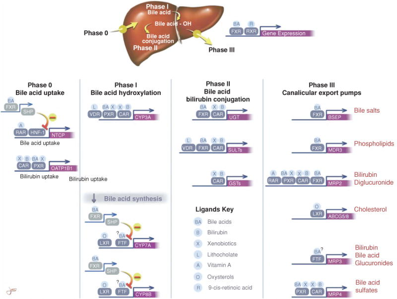
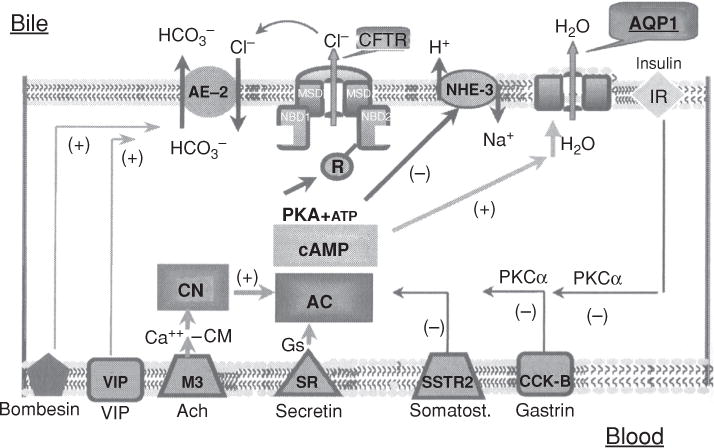

## Vereisten

Voor het schrijven van een paper zul je je moeten verdiepen in de wetenschappelijke literatuur. Het lezen van artikelen kost tijd en kun je ook leren. Om dit als team te doen gaan jullie elkaar helpen. Ieder teamlid leest 2 artikelen vat deze samen zodat het team de essentie van het artikel kan begrijpen.

Schrijf 2 samenvattingen over papers die gerelateerd zijn aan je onderzoeksopdracht.

De samenvatting (geschreven in het Nederlands, zónder gebruik van AI) moet het volgende bevatten:

-Eigen woorden (dus geen vertalingen van zinnen)

-Introductie, waar je ook externe bronnen mag gebruiken om onbekende termen of technieken uit kan leggen. Hier beschrijf je de onderzoeksvraag en de leg je de (belangrijkste) methoden uit, eventueel met figuren

-Beschrijf waarom de methode die auteurs hebben gekozen geschikt is voor dit onderzoek

-Beschrijf de belangrijkste resultaten en beschrijf ook minstens 1 figuur uit de resultaten

-Een korte samenvatting van de eindconclusie (in eigen woorden)

De samenvatting is géén abstract

## Gekozen papers

Eerste paper - @boyer2013 - Informatie over "bile" en het belang er voor in de lever. Dit is een paper die met ons onderzoek te maken heeft omdat ons onderzoek veel gebruik maakt van "bile" samples. Hierom is het handig om te begrijpen wat het is, Hoe het ontstaat, waarvoor het gebruikt word en de compositie. Dit wordt in dit artikel beschreven en zal ik samenvatten tot een netjes en leesbaar geheel.

Tweede paper - @singh2019 - Multi-omics omvat een groot aantal tools, Na analyse van verschillende tools zoals MoFA+, Multi-Anova en andere statistische tools leek Diablo mij erg interessant. Dit is om meerdere redenen, Diablo kan kijken naar verschillende omics waaronder Transcript- & proteomics wat in onze research paper de data is, en Diablo zoekt identificeert essentiële moleculaire stuurders.

# Introductie - @boyer2013 -

Bile ook wel Gal, een bitter gele vloeistof die gemaakt word in de lever. Gal is essentieel voor de functie van het lichaam maar ook essentieel voor lever transplantatie. Een gal monster kan worden uitgelezen voor eiwit patronen wat de onderzoekers veel kan vertellen. Omdat gal ook een belangrijk onderdeel is van het gekozen hoofdonderzoek is het belangrijk om wat achtergrondinformatie hierover te verkrijgen.

Deze samenvatting zal gaan over wat de algemene functies zijn van gal, waaruit gal is opgemaakt en welke dingen in deze structuur belangrijk zijn voor het gekozen hoofdonderzoek, en nog wat extra dingen die het artikel @boyer2013 als belangrijk benoemtt. Dit artikel bespreekt en de meest recente kennis over belangrijke onderwerpen benoemtt zoals Gal vorming, de componenten van gal, transport, signaalpaden, galductcellen en Cellular en moleculaire bepaling van galformatie. Het doel van dit review artikel is de historische mijlpalen in ontwikkeling te bespreken en de meest recente kennis over alle benoemde onderwerpen van het Gastro-enterologie veld samen te vatten.

Het artikel komt uit een tijdschrift genaamd "Comprehensive Physiology" Dit tijdschrift publiceert artikelen in het interdisciplinaire veld van interorgaancommunicatie in gezondheid en ziekte. Onderwerpen die dit tijdschrift behandeld zijn inter-orgaan cellulaire communicatie, signaalpaden, orgaan overspraak, systeembiologie, inter-orgaan pathologie en pathogenesis, de rol van hormonen en neurotransmitters. Het tijdschrift heeft naast artikelen ook reviews en editorials @comprehe . Dit is belangrijk om te zien of het artikel wel van kwaliteit is. Artikelen die gepubliceerd zijn in tijdschriften moeten langs een keuring van wetenschapsjournalisten waardoor het artikel betrouwbaarder is.

## **Methode**

De reden om deze methode te gebruiken in plaats van een nieuw experiment te starten is omdat het doel was om alle informatie te verzamelen en op 1 plek samen te vatten met correcte referenties. Hierdoor is het voor andere onderzoekers makkelijker om de correcte informatie te vinden in plaats van meerdere papers lezen voor kleine delen informatie.

## **Resultaten**

In de resultaten noem ik de belangerijkste punten op per onderwerp van de review.

*Anatomische bepalende factoren van galafscheiding*

De lever structuur is bepalend in galafscheiding. Bepaalde anatomische factoren hebben hier invloed op zoals, microvilli deze verhogen op cellulair niveau het oppervlak van de galcanaliculus, deze is omringd door een netwerk van actinefilamenten deze dragen bij aan de galstroming. De zonering in de leverlobuli heeft invloed op de vorming van gespecialiseerd gal door hepatocyten, dit is afhankelijk van hun locatie. Het gal wordt daarna verder bewerkt in het **galweg**systeem, dit bestaat uit een netwerk van buisjes wat gevuld is met cholangiocyton. De dubbele bloedvoorziening van de lever zorgt voor cholehepatische circulatie waardoor componenten uit het gal opnieuw kunnen worden opgenomen.

*Wat zijn de componenten van gal?*

Gal is een vloeistof wat gemaakt word in lever maar wordt bewaard in je galblaas. De gal vloeistof bestaat uit veel dingen voornamelijk water, ongeveer 95% van gal bestaat uit water. Andere dingen die in gal te vinden zijn Elektrolyten dit zijn stofjes die natuurlijk positief of negatief geladen zijn wanneer ze opgelost zijn in water. Elektrolyten helpen je lichaam in regulatie van chemische reacties, zorgen voor de balans tussen vloeistof binnen en buiten de cellen en spiercontractie. Ze zijn ook essentieel om medische problemen en ziekten te identificeren. Organische Anionen (een ion met een negatieve lading, gelijk aan het aantal opgenomen elektronen) zoals galzouten, primaire zuren zoals cholic zuur en chenodeoxycholic zuur of secondaire zuren zoals deoxycholic zuur en lithocholic zuur. Ook bevat gal Lipiden zoals cholesterol en steroïde hormonen. Nucleotiden zoals ATP, ADP en AMP zijn ook terug te vinden waardoor er te zien is hoeveel energie bepaalde functies nodig hebben. Ook te vinden in gal zijn, Eiwitten, Plasma eiwitten, Albumine, Haptoglobine, Immunoglobine A, Apo-transferrin, Feromonen, Prolactine, Insuline. Het is de paper niet precies aangegeven hoeveel hiervan aanwezig is maar er wordt bij de **Bile/plasma ratio** Wel een \<1 of \>1 aangegeven. Andere stoffen die in bile kunnen zitten zijn Hepatocyte eiwitten, Alkaline fosfaat, Zuur fosfaat, N-acetyl-β-glucosaminidase, β-glucuronidase, β-galactosidase, 5'-nucleotidase, Peptiden en aminozuren (GSH, GSSG, Cystinyl glycine, Glutamic zuur, Cysteine, FGF19, Asparatic zuur, Glycine) Zware metalen (Koper, Mangaan, Ijzer, Zink), En vitamines zoals 25-OH vitamine D, Cyanocobalamin, Riboflavin en Folate.

*Mechanisme voor de vorming van gal*

Gal wordt gevormd door filtratie in reactie naar osmotische gradiënten die gemaakt zijn door transport van osmotische actieve opgeloste stoffen naar galkanaal lumen. Water en kleine opgeloste stoffen komen passief de galruimte binnen via een "oplosmiddelweerstand". Dit proces gebruikt ATP en wordt niet beïnvloed door de hydrostatische druk die komt van het bloed dat de sinusoïden (Een sinus is een klein bloedvat dat een soort capillair is vergelijkbaar met een gefenestreerde endotheel**)** in de lever persfuseert.

*Cellulaire en Moleculaire bepaling van galformatie*

Dit onderwerp heeft veel subonderwerpen door het grote aantal processen, De processen, eiwitten en enzymen zijn op te delen in 4 fasen en om het simpel en leesbaar te houden zal ik ook de 4 fasen beschrijven. Ik zal de belangrijke enzymen en eiwitten benoemen en de functie van de fase uitleggen. De meeste van deze eiwitten zijn kenmerken op het moleculaire niveau van de menselijke lever en hun functionaliteit is bepaald beide in vitro en in vivo.

**Samenvatting van alle Fase**

**Fase 0**

fase 0 bestaat uit hepatic-uptakemechanisme deze zijn op het basolaterale membraan van de hepatocyte te vinden en bepalend voor hoe de organische oplossingen de lever binnenkomen.

Sodium-taurocholate cotransporting polypeptide ook wel SLC10A/NTCP is een primair mechanisme voor de opname van galzouten uit sinusvormig bloed. Door middel van Sodium kan dit mechanisme ATP verkrijgen en is hierdoor in staat om opgeloste stoffen de hepatocyte in te verplaatsen dit is secundair actief transport.

Een ander mechanisme is organic anion transporting polypeptides OATPs. Dit mechanisme neemt organische ionen op, de belangerijkste OATPs is OATP1B1, dit mechanisme maakt gebruik van de concentratiegradiënt om stoffen te transporteren in plaats van ATP te gebruiken.

Fase 1

Gal zuur hydroxylizatie

Fase 1 functies worden voornamelijk uitgevoerd door intracellulaire cytochroomenzymen deze metaboliseren hydroxylate lipide-oplosbare substraten zodat reacties in fase 2 mogelijk worden.

De opgenomen stoffen moeten worden bewogen naar de andere delen van de cell, naar het apicale membraan. Dit kan door "rapid diffusion" samen met cytosolische eiwitten of door intracellulaire membranen zoals ER, of door transcytose in membraanvaten samen met microtubules.

Welke weg gekozen word hangt af van hoe hydrofoob de stof is. Als de stof erg hydrofoob is zal het sneller kiezen om intracellulaire membranen gebruiken in plaats van de cytosolische eiwitten.

Na het transport binden stoffen als galzouten, en andere hydrofiele anionische substanties zich aan de cytosolische proteïnen zoals 3 alfa-hydroxylsteroïde dehydrogenase en andere stoffen.

Stoffen die lipofiel zijn zullen zich associeren met de intracellulaire membranen en fase 2 ondergaan, terwijl de organische kationen kunnen worden vastgehouden in negatief geladen lysomale structuren waardoor hun uitscheiding vertraagd wordt.

Fase 2

Fase 2 reacties omvat van enzymen die veel organische stoffen met sulfaat, glucuronides, GSH of acetylgroepen conjugeren om hun wateroplosbaarheid te verbeteren en dat deze stoffen kunnen worden getransporteerd door de transporters in fase 3

Fase 3

Fase 3 transporters zijn export pompen die de opgeloste stoffen uit de hepatocyten halen en terug in het gal of systeem circulatie brengen. De primaire functie is de hepatocyten te beschermen tegen de opbouw van giftige stoffen maar ze kunnen invloed uit oefenen over de algemen doorstroming van galzouten en andere organische anionen die uitgescheiden worden naar het gal door de concentratie van deze substanties te limiteren binnen elke individuele hepatocyte.

*galductcellen*

De galductcellen zijn de Cholangiocyten, ze hebben de primaire functie om het kanaalgal vloeibaar te maken en te alkaliseren. Dit proces gebruikt verschillende secretoire en absorptieve functies van de cellen. Cholangiocyten vormen epithelium van de "intrahepatic biliary tree". Dit zijn ook wel de galwegen, deze galwegen zijn een complex heterogeen netwerk van afvoerbuizen. De galwegen zorgen dat gal binnen komt bij de galblaas en de darm. De cholangiocyten hebben ook secretoire en absorptieve functies, deze zorgen voor een variabele component van het uiteindelijke volume gal. Dit kan de uiteindelijke secretie die naar de twaalfvingerige darm wordt getransporteerd aanzienlijk beïnvloeden. Deze secretoire en absorptieve functies hebben transportsystemen die gereguleerd door hormonen die vrijkomen door voeding en hun specifieke receptoren om te kunnen functioneren.

*Uitleg figuur 10*

Dit figuur beschrijft de Hormonale regulatie van cholangiocyte HCO3- afscheiding gebaseerd op studies van rat-achtigen.

Cholangiocyten spelen een belangrijke rol bij de verdunning en alkanisatie van gal geproduceerd door de lever. Dit doen ze door bicarbonaat (HCO3- ) af te geven aan het gal. De voordelen van het bicarbonaat in het gal is de neutralisatie van het gal, en de bescherming van de galwegen tegen de potentiële schadelijke stoffen die in het gal kunnen zitten. Dit proces wordt gereguleerd door hormonen.

De hormoon regulatie:

**Secretine (SR)**

Zorgt voor toename in gal productie, Het bindt zich aan de secretinereceptor (SR) op de cholangiocyt. Dit activeert adenylaatcyclase (AC), wat leidt tot toename van cyclisch AMP (cAMP). cAMP activeert vervolgens proteïnekinase-A (PKA) wat de CFTR in werking zet door middel van ATP die toegevoegd word aan de PKA.

**Acetylecholine (ACH / M3)**

Sensibiliseert de adenylaatcyclase voor secretine wat betekent dat aanwezigheid van acetylcholine, secretine een sterkere respons geeft. Acetylecholine bindt aan muscarine receptor 3 (M3) wat leidt tot toename van intracellulair calcium (CA++) dit activeer via calmodulin (-CM) het enzym calcineurine (CN). CN beïnvloedt adenylaatcyclase (AC), waardoor het gevoeliger wordt voor stimulatie door secretine.

**Vasoactief intestinaal peptide (VIP) + Bombesin**

Stimuleert de bicarbonaatsecretie door de cholangiocyten. Dit gebeurd door een pad wat onafhankelijk is van CN en AC. VIP en bombesin hebben beide een positief (stimulerend) effect op AE-2 (Zet HCO3- van bloed naar gal)

**Somatostine, Gastrine en Insuline**

Deze remmen zowel basale bicarbonaat secretie als de door hormonen gestimuleerde secretie. Dit gebeurd via een PKC-alpha afhankelijk pad. receptoren voor SSTR2 somatostatine, gastrine, CCK-B en insuline IR. Deze receptoren leiden tot activering proteïne kinase C alpha wat een remmend effect heeft op AC.

**Extra belangrijke spelers**

**Cholangiocyten**

De cellen van de galwegen die bicarbonaat afscheiden HCO3- en de gal alkaniseert.

**Cl- / HCO3- exchange AE2**

een eiwit in het apicale membraan (de kant richting de galwegen) van de cholangiocyten dat bicarbonaat naar de gal transporteert wanneer Cl- aanwezig is dit is een belangrijke route voor bicarbonaat secretie.

**CFTR (Cystic fibrosis transmembrane conductance regulator)**

Een chloridekanaal in het apicale membraan. CFTR is belangrijk omdat het chloride lever wat nodig is voor de Cl-/HCO3- wisselaar om te functioneren (Cl- gaat de cel in via CFTR en wordt gebruikt door AE-2 om bicarbonaat uit te wisselen)

**NHE-3 (Sodium Hydrogen Exchanger isoform 3)**

een eiwit in het basolaterale membraan (de kant richting het bloed) dat Na+ de cel in transporteert in ruil voor waterstofionen H+ dit help bij handhaven van de ph in de cel en kan indirect bijdragen aan de bicarbonaat productie

**AQP1 (Aquaporin 1)**

Een water kanaal in het apicale membraan dat watertransport mogelijk maakt, dit helpt het gal te verdunnen als bicarbonaat wordt uitgescheiden.

*Signaaltransductieroutes bij de regulatie van galafscheiding*

Meerdere posttranscriptionele regulatie wegen bestaan in hepatocyten en cholangiocyten om het uiteindelijke gal secretoir product te bepalen. Dit zijn signaal transductie tweede bericht wegen die werken in groten deels door hormonen in combinatie met hormoon receptors, calcium via inositoltrifosfaatreceptoren, nucleotiden via purinerge receptoren, en cytokines via cytokinereceptoren. recente studies hebben ook laten zien dat galformatie kan worden beinvloed en gereguleerd door posttranscriptionele terugdraaiende epigenetische modificaties van histonen en chromatine.

*Transport en uitscheiding van specifieke stoffen (Lipide*)

Lipide secretie

De grootste lipidebestanddelen van gal zijn PC (Phosphatidylcholine) en cholesterol. Pc komt in het canaliculaire membraan via een cytosolisch transport eiwit of binnen blaasjes. Dit wordt gelopt naar de buitenste folder via MDR3. Het resulterende opgebouwde PC aan de buitenste folder van het canaliculair membraan is van nature onstabiel waardoor de galzouten uitgescheiden in het canalicular lumen misschien direct PC extractie faciliteren. Een alternatieve hypothese zegt dat galzouten microdomeinen van PC destabiliseren die zich hebben verzammeld bij de uiterste folder, waardoor de vesicles die als eerste bewegen daarna afgeknepen worden in het gal.

Cholesterol wordt het gal in uitgescheiden door heteromere ABC-transporters, Uitscheiding via de MDR3 wordt ook gedacht een rol te hebben bij de cholesteroluitscheiding. Voor nu is het nog onduidelijk hoe de ABC transporters precies werken. Cholesterol geassocieerd met HDL word opgenomen door SR-B1 bij het basolaterale membraan van de hepatocyten waarna het direct uitgescheiden word in het gal. Het exacte mechanisme is hier ook nog niet helemaal duidelijk maar onderzoek zegt dat het met carrier protein-2 te maken heeft.

## **Eind conclusie**

Gal is een belangrijk voor de functie van de lever, Het begrijpen van de secretie en formatie is essentieel om gal te kunnen begrijpen. Door technologische ontwikkelingen in de applicatie van moleculaire en cellulaire analyses en technieken werd het makkelijker om gal te studeren. kennis over galformatie is in de afgelopen jaren sterk gestegen wat de basis was voor deze review. Belangrijke historische ontwikkelingen die benoemt worden in deze review waren de kenmerkend van belangrijke transporters en enzymen die te maken hebben met de mechanisme die gal vormen. Dit is op moleculaire niveau gedaan in dieren en in de mens. Mutaties en polymorfismen in sommige determinanten die gevonden waren hebben ook nog specifieke functies voor transporters of enzymen. Uitleg over alle belangrijke mechanismen zijn te vinden in de body van de review, hier zijn zoals eerder gezegd allemaal verschillende belangrijke onderwerpen te vinden. Mechanismen zoals hepatocyten tegenover cholangiocyte secretie worden hier ook uitgelegd. Toekomstig onderzoek zou moeten worden gedaan naar de benoemde mechanismen, deze zouden beneficieel moeten zijn voor patiënten waar galformatie verhinderd is door dingen als cholestatische leverziekte of andere ziekten. De opgeloste stoffen die zich in gal bevinden is heel groot en het effect en hun rol in de mechanismen zijn nog onduidelijk en moeten dus ook bestudeerd worden. Belangrijkste stoffen die moeten worden bekeken zijn de metalen, vitaminen en eiwitten. Gal beter begrijpen is essentieel voor de verbetering in zorg voor lever problemen en kwaliteit.

# Introductie - @singh2019

Multi-omics is een relatief nieuw veld de eerste publicaties kwamen uit 2006 waarna de publicaties per jaar in 2018-2020 fors steeg. Multi-omics is de vergelijking van meerdere data uit de verschillende omics velden met elkaar en hierin een link leggen. De reden om multi-omics te gebruiken in plaats van single-omics analyses, is om een accuraat beeld van moleculaire netwerken te schetsen wanneer deze veranderen met ziekte. Neem bijvoorbeeld het linken van Genen (DNA-genomics) en de proteinen (proteomics) die zorgen voor problemen bij de patiënten. Dit kan nu gedaan worden met verschillende tools zoals MoFA+, Multi-Anova. Veel van deze unsupervised methoden zijn niet gericht op discriminatie tussen bekende fenotypen, en veel bestaande supervised methoden hebben beperkingen zoals niet goed meenemen van interacties tussen de verschillende "omics" lagen. In deze samenvatting ga ik het hebben over de DIABLO-tool. De DIABLO-tool kijkt in het kort naar de verschillende datasets die het heeft gekregen en zoekt plus identificeert essentiële moleculaire stuurders. Deze kunnen dan in een vervolganalyse worden bekeken voor functie en of invloed op de patiënt. DIABLO identificeert en discrimineert tegelijkertijd.

## **Methoden**

Diablo gebruikt een bestaande formule die bewezen is te werken en bouwt hierop dit geeft dus een goeie basis wat een slimme stap is. Nadat ze de General multivariate integrative framework hebben gebouwd,

De methode geeft ook advies over wat voor input data nodig is, en dat dit genormaliseerd moet zijn. Dit is handig om te weten voor de diablo gebruiker echter lijkt mij dit onlogisch hier aangezien voor repliceerbaarheid je wil weten wat hun data was en hoe ze dit hebben gebruikt.

De Parametertuning is een logische stap, nadat er een model wordt gemaakt wil je de accuratie en foutpositieven en foutnegatieven er uit halen zodat de resultaten ook betrouwbaar zijn.

De klassevoorspelling, Nadat het model getraind is kan het gebruikt worden om de fenotype van nieuwe monsters te voorspellen. Dit is belangrijk voor het praktische aspect van een classificatiemethode. Door elk 'omics' datatype .

Visualisatiehulpmiddelenn, het artikel benoemt manieren voor visualisatie zelfs met een package die bij de tool hoort. Deze package heet mixOmics. Dit is erg handig omdat deze tool zorgt dat de output voor mensen leesbaar word waardoor onderzoekers verbanden kunnen leggen. Dit is niet deel van de bouw van DIABLO maar helpt de eindgebruiker wel.

Uiteindelijk is deze materiaal en methoden niet goed voor replicatie maar dit is ook geen experiment het is een tool. Daarom zou ik zeggen dat replicatie niet persee het hoofddoel is, maar uitleg van de tool is het hoofddoel. De uitleg van de tool is goed en suggesties over visualisatie zijn ook erg handig.

## **Resultaten**

Dit is het belangerijkste resultaat in relatie met ons onderzoek. Dit is omdat wij naar biomarkers zoeken die high biliary viability laten zien.

**De identificatie van multi-omics biomarkers**, DIABLO zocht moleculaire kenmerken biomarkers dus. Deze identificatie werd gedaan met verschillende datatypen: mRNA, miRNA, CpGs en eiwitten. Na een panel samen te stellen met deze verschillende datatypen werd er gezocht naar biomarkers voor borstkanker. Er was een 22.9% foutpercentage op onafhankelijke testset. Dit resultaat zegt dat een biomarkerpanel geselcteerde door DIABLO reproduceerbaar was en toepasbaar op nieuwe monsters. Hey biomarkerpanel was ook biologisch relevant, omdat veel van de geselecteerde variabelen bewezen relatie hadden met borstkanker gebaseerd op bestaande datavbases. DIABLo identificeerde ook een aantal variabelen die nog niet eerder waren geasscieerd met borstkanker, dit kan duiden op de mogelijkheid om nieuwe biomarkers te ontdekken met DIABLO. Kortom, dit resultaat laat zien dat DIABLO succesvol kan worden toegepast op complexe multi-omics data om een biologisch relevant en voorspellend panel van biomarkers te identificeren voor ziekten zoals borstkanker.

Figuur 3b laat de Proteinen, mRNA, miRNA en CpGs zien en de connecties tussen ze. Dit is een netwerkvisualisatie. De paper beschrijft het als een netwerkvisualisatie van het biomarkerpanel. Dit laat dus onderlinge verbanden zien tussen de verschillende "omics" datatypen per variabele. Alle punten hier hebben een Pearsons correlatie boven de 0.4 . De kleuren geven aan waar verschillende clusters of gemeenschappen van biomarkers die door analyse zijn geïdentificeerd als dicht onderling verbonden. Deze clusters zijn sets van moleculen die waarschijnlijk biologisch samenhangen in relatie tot borstkankersubtypen.

#### **Formule:** sGCCA

$$
\max_{\alpha_h^{(1)}, \dots, \alpha_h^{(Q)}}
\sum_{\substack{i, j = 1 \\ i \ne j}}^{Q} c_{i,j} \cdot \operatorname{cov}\left( X_h^{(i)} \alpha_h^{(i)}, X_h^{(j)} \alpha_h^{(j)} \right)
$$

$$
\text{onder de voorwaarden:} \quad
\|\alpha_h^{(q)}\|_2 = 1 \quad \text{en} \quad \|\alpha_h^{(q)}\|_1 \leq \lambda^{(q)} \quad \text{voor alle } q = 1, \dots, Q
$$

Dit is een enorm belangrijke maar complexe formule dus deze leg ik ook uit.

-   $a^{(i)}_h$: coëfficiëntenvector voor dataset $i$ in dimensie $h$
-   $X^{(i)}_h$: datamatrix voor dataset $i$ in dimensie $h$
-   $Q$: aantal datasets
-   $N$: aantal samples (bijv. patiënten)
-   $P_q$: aantal variabelen in dataset $q$

De data moet bewerkt worden, Vóór gebruik moet je de data normaliseren, centreren en schalen.

Het doel is om gewichten te vinden die:

-   De latente componentscores $X^{(i)}_h a^{(i)}_h$ maximaal laten correleren over datasets
-   Alleen de belangrijkste variabelen selecteren

#### Beperkingen op de coëfficiënten

De coëfficiëntenvectoren $a^{(q)}_h$ moeten voldoen aan:

#### L2-norm beperking:

$||a^{(q)}_h||_2 = 1$

-   De lengte van de vector is gelijk aan 1
-   Dit is een standaardmanier om coëfficiënten te normaliseren, zodat hun grootte niet onbeperkt groeit tijdens het maximaliseren

#### L1-norm beperking (sparsity):

$||a^{(q)}_h||_1 \leq k^{(q)}_h$

-   Som van de absolute waarden van de elementen in de vector
-   $k^{(q)}_h$ is een niet-negatieve parameter die bepaalt hoeveel selectie er plaatsvindt
-   Kleinere $k^{(q)}_h$ → sterkere penaliteit → meer nulwaarden → variabelenselectie

#### Interpretatie

De formule zegt in feite:

> "Vind de gewichten voor elke dataset zodanig dat de samenvatting van de datasets zo goed mogelijk met elkaar samenhangt, terwijl je de gewichten normaliseert en alleen de belangrijkste variabelen selecteert (niet-nul gewichten), via de $k^{(q)}_h$-parameter."

#### Covariantiematrix en Designmatrix

-   $X^{(i)}_h a^{(i)}_h$: levert latente componentscores op
-   $\text{Cov}(X^{(i)}_h a^{(i)}_h, X^{(j)}_h a^{(j)}_h)$: covariantie tussen scores van dataset $i$ en $j$

We maximaliseren:

$\sum_{i,j=1; i \ne j}^J c_{ij} \text{Cov}(X^{(i)}_h a^{(i)}_h, X^{(j)}_h a^{(j)}_h)$

#### Designmatrix $C$

-   $c_{ij}$: bepaalt welke datasets onderling verbonden zijn
-   $c_{ij} = 0$: covariantie tussen datasets $i$ en $j$ wordt niet meegenomen
-   $c_{ij} = 1$: covariantie tussen datasets $i$ en $j$ wordt wel meegenomen

Dit biedt flexibiliteit om bijvoorbeeld alleen specifieke verbanden tussen datasets te bestuderen.

## **Eind-conclusie**

Diablo is ontworpen om de connectie te vinden tussen moleculaire patronen, dit doet het over verschillende datatypen (mRNA, miRNA, CpGs, eiwitten) waar het kijkt naar gerelateerde fenotypen. De auteurs zeggen dat DIABLO als een data-gedreven, allesomvattende tools is die biomarkers kan ontdekken en inzicht vergroten in moleculaire processen die ziekte aansturen. multi-omics heeft de uitdaging dat het biologisch relevantie moet vinden, gecorreleerde patronen en het bereiken van goede voorspellende nauwkeurigheid voor fenotypes. Dit is wat DIABLO zou moeten bereiken. De beperkingen van DIABLO is dat het uitgaat van lineaire verbanden tussen kenmerken. Het is ook primair ontwikkeld voor continue data, het selecteren van het optimale aantal variabelen en het batch-effect / verstorende variabelen in de data. Deze dingen kunnen extra aandacht vragen in de analyse.
