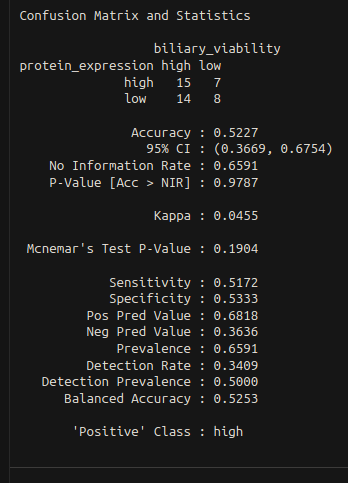
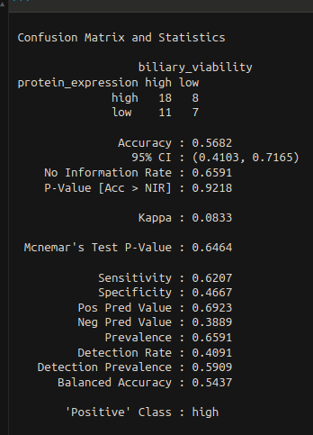
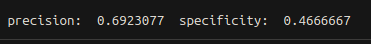
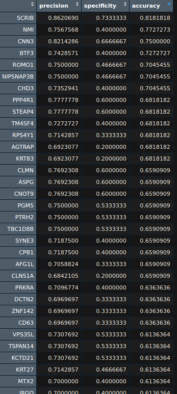

```{r,}
knitr::opts_chunk$set(eval = FALSE)
```

# preliminary proteomics tool research

msn base:
https://bioconductor.org/packages/release/bioc/html/MSnbase.html

AIO solution for general proteomics processing from the mass spectometry to visualisation

msgf+:
for protein identification
e value calculation
minimal as possible protein clusters
protdb or smth files to compare to


# dividing of tasks
me: confusion matrix
jarno: pls-da
yamila: normalisation & imputation
ramon: pca


# Key Terms

Biliary viability:

A measure of liver health post-transplant, categorized as "High" or "Low" based on clinical outcomes.

Threshold:

Protein expression cutoff to classify samples (e.g., median, mean of means).

Negative expression correlation:

When lower protein expression predicts high viability (reverse threshold logic).

Fisher’s exact test:

Statistical test for contingency tables (e.g., confusion matrices). Provides p-values.

# confusion matrix
what do i need for a confusion matrix and what is it for?:

I need candidates from the pca for biomarker, since this is proteiomics I need proteins.
I also need a threshold to determine what is high and what is low expression

the matrix is for finding the precision of potential biomarkers(prediction data) in comparison to the biliary viability groups(actual data)

for the threshhol and optimal biomarker performance I can do the following options:

- mean (very good against outliers but assumes high is about half of the dataset)
- mean + std (assumes high is more rare)

loading in count data
```{r}
# load("/students/2024-2025/Thema08/liver-transplant/proteomics/count_data.Rdata")
```

loading in meta data
```{r}
# load("/students/2024-2025/Thema08/liver-transplant/proteomics/meta_data.Rdata")

```

loading in imputed count data
```{r}

# load("/students/2024-2025/Thema08/liver-transplant/proteomics/normalized_imputed_count_data.Rdata")

```

seperate into 2 groups
```{r}
high_viability_data <- assay_norm[, grep("^High", colnames(assay_norm))]
low_viability_data <- assay_norm[, grep("^Low", colnames(assay_norm))]


```

```{r}
type(assay_norm)
```
```{r}
colnames(assay_norm)
```

summary
```{r}

summary_high_vial <- DataFrame(high_viability_data)
summary(summary_high_vial)


```


protein to use as potential biomarker
```{r}
pot_biomarker <- "IGLV7-46"
```

```{r}
pot_bio_marker_high_counts <- DataFrame(high_viability_data[pot_biomarker, ])

```

biomarker corresponding count values
```{r}
pot_bio_marker_high_counts <- data.matrix(high_viability_data[pot_biomarker, ])
```

```{r}
pot_bio_marker_low_counts <- data.matrix(low_viability_data[pot_biomarker, ])
```


determining low/high expression categorisation (in this case I will use the median of the potential biomarker's expression values)

I am redoing the flow of this to optimise a little bit, because we might be doing this on a larger scale.

so instead of splitting the groups immediatly into low/high viability, I will first get the pot_biomarker's corresponding count val

```{r}
# clearing env
rm(list=ls())

# loading in imputed and normalised data
# load("/students/2024-2025/Thema08/liver-transplant/proteomics/normalized_imputed_count_data.Rdata")

# choosing potential biomarker protein (current one is random)
pot_biomarker <- "IGLV7-46"

# filtering for the counts of only the potential biomarker
pot_bio_marker_counts <- data.matrix(assay_norm[pot_biomarker, ])

# determining the median for the expression categorisation threshhold
expression_categorisation_threshold <- median(pot_bio_marker_counts)

# divinding the counts into low and high viability groups
high_viability_pot_bio_marker_counts <- 
    data.matrix(pot_bio_marker_counts[grep("^High", rownames(pot_bio_marker_counts)),])

low_viability_pot_bio_marker_counts <- 
    data.matrix(pot_bio_marker_counts[grep("^Low", rownames(pot_bio_marker_counts)),])


```

making the matrixes into dataframes for filtering purposes
```{r}
high_viability_pot_bio_marker_counts_df <- data.frame(high_viability_pot_bio_marker_counts)
low_viability_pot_bio_marker_counts_df <- data.frame(low_viability_pot_bio_marker_counts)
```

checking on the df
```{r}
high_viability_pot_bio_marker_counts_df
```
load in dyplr for count function
```{r}
library("dyplr")
```
test on initial matrix value of top left aka high biliary and high expression
```{r}
true_true <- sum(high_viability_pot_bio_marker_counts_df$high_viability_pot_bio_marker_counts
 > expression_categorisation_threshold)
```

matrix values calculated (I have made it so expressions equal to the threshold still count as highly expressed, note that there is no logic behind this) 
```{r}
# confusion matrix scores

# biliary viability is high and so is protein count
true_true <- 
    sum(high_viability_pot_bio_marker_counts_df$high_viability_pot_bio_marker_counts
 >= expression_categorisation_threshold)

# biliary viability is low and protein count is high
false_true <- 
    sum(low_viability_pot_bio_marker_counts_df$low_viability_pot_bio_marker_counts
 >= expression_categorisation_threshold)

# biliary viability is low and so is protein count
true_false<- 
    sum(low_viability_pot_bio_marker_counts_df$low_viability_pot_bio_marker_counts
 < expression_categorisation_threshold)

# biliary viability is high and protein count is low
false_false <- 
    sum(high_viability_pot_bio_marker_counts_df$high_viability_pot_bio_marker_counts
 < expression_categorisation_threshold)

```

loading in the caret library for automatic confusion matrices
```{r}
if (!require("caret", quietly = TRUE)) {
  install.packages("caret")
  library("caret")
}
```

inputting the values into the ConfusionMatrix() funtion. reference: https://www.rdocumentation.org/packages/caret/versions/7.0-1/topics/confusionMatrix
```{r}
confusionMatrix(  
    # transform into a table
    as.table(matrix(c(false_false, false_true, false_false, true_true), nrow = 2)),
  positive = "positive"
)
```
I think it doesn't work because the data is in an incompatible format

put the data in a matrix instead of a table to prep it for caret
```{r}
matrix(c(true_false, false_true, false_false, true_true),
    nrow = 2,
    dimnames = list(
    protein_expression = c("low", "high"),
    biliary_viability = c("low", "high")))
```
bit of an unclear confusion matrix compared to the usual format

make the same matrix but with labels that are more standard
```{r}
conf_matrix <- matrix(c(true_false, false_true, false_false, true_true),
    nrow = 2,
    dimnames = list(
    protein_expression = c("false", "true"),
    biliary_viability = c("false", "true")))
```
due to this njot working in the caret function it could still make a good backup handmade matrix

better layout(subjectiovely speaking) matrix
```{r}
conf_matrix <- matrix(
  c(true_true, false_false, 
    false_true, true_false),
  nrow = 2,
  dimnames = list(
    protein_expression = c("high", "low"),      
    biliary_viability = c("high", "low")    
  )
)
```


put it in caret function again
```{r}
confusionMatrix(conf_matrix,
                positive = "positive") # seems to only be lable according to the documentation
```
according to the documentation it has to be of "class table" so back to table

```{r}
confusionMatrix(as.table(conf_matrix), #data
                positive="high")
```
subscript out of bounds again


turns out the positive wasn't a lable but had to instead match the lable given to the true option in the table object
```{r}
confusionMatrix(as.table(conf_matrix), #data
                positive="true")
```


The initial loading in of the Rdata doesn't work anymore because the file cannot be found for some reason.
So I will try to navigate to the folder before once again loading in the Rdata object
```{r}
# navigating to the folder the file is in
setwd("/students/2024-2025/Thema08/liver-transplant/proteomics/")

# checking on the current directory
getwd()

# load in the file
load("normalized_imputed_count_data.Rdata")

```
This still doesn't work

turns out it's because the file got renamed so we change the loading in chunk to the following:
```{r}
load("/students/2024-2025/Thema08/liver-transplant/proteomics/normalized_imputed_count_data_30min.Rdata")

```

I want to make this script more efficent as we might (hopefully) need to upscale this.

## final version of confusion matrix script

clear environment of previous objects
```{r}
# clear env
rm(list=ls())
```

load in caret library
```{r}
if (!require("caret", quietly = TRUE)) {
  install.packages("caret")
  library("caret")
}
```

load in data
```{r}
#oad in data
load("/students/2024-2025/Thema08/liver-transplant/proteomics/normalized_imputed_count_data_30min.Rdata")
```

define potential bio marker protein
```{r}
# potential biomarker definitin
pot_biomarker <- "IGLV7-46"
```

extract only relevant expression data
```{r}
# filter for expression values of only the biomarker
pot_bio_marker_counts <- assay_norm[pot_biomarker, ]
```

threshold definition
```{r}
# get median threshhold (note that this is temp and if another is neccesary then we will do that)
expression_threshold <- median(pot_bio_marker_counts)
```

split the expression data into high and low viability groups with grepl instead of grep so I won't have to run it twice by basically creating a mask for both viabilities whilst keeping the original pot_bio_marker_counts
```{r}
# split into viability groups
high_viability <- grepl("^High", names(pot_bio_marker_counts))
low_viability <- !high_viability
```

"calculate" matrix components. this time with better lables cause I found the previous ones confusing
```{r}
true_positive <- sum(pot_bio_marker_counts[high_viability] >= expression_threshold)
false_positive <- sum(pot_bio_marker_counts[low_viability] >= expression_threshold)
true_negative <- sum(pot_bio_marker_counts[low_viability] < expression_threshold)
false_negative <- sum(pot_bio_marker_counts[high_viability] < expression_threshold)
```

make a matrix with the elements generated. honestly it would be more efficient to make a table directly but that's a format that offers less control and the effort required for it doesn't seem worth it.
```{r}
conf_matrix <- matrix(
  c(true_positive, false_negative, # fuckass layout for the actual data in the matrix
    false_positive, true_negative),
  nrow = 2, # amount of rows
  dimnames = list(
    protein_expression = c("high", "low"),  # labels for the rows
    biliary_viability = c("high", "low")    # labels for the columns
  )
)
```

convert to confusionMatrix object of caret and all the stats that accompany it
```{r}
final_matrix <- confusionMatrix(
  as.table(conf_matrix), # convert matrix obj to table so it's suited in terms of input
  positive = "high" # give the label for the equivalent of positive in a confusion matrix
)

print(final_matrix)
```


basically for efficiency's sake I tried to avoid using complicated data structures like matrices and dataframes. and lessen the amount of casting I used for convenience


loading in the dep library and the biocmanager package
```{r}
if (!requireNamespace("BiocManager", quietly = TRUE))
    install.packages("BiocManager")

BiocManager::install("DEP")
```
load in DEP
```{r}
if (!require("DEP", quietly = TRUE)) {
  BiocManager::install("DEP")
  library("DEP")
}
```

load in depmap result for both datasets
```{r}
load("../../tai_local_data/dep_high_vs_low_30min.Rdata")
```

```{r}
get_results(data_diff_30min)
```


## looking for a new a new threshold method

we're looking to find what method for thresholds generation will be best for biliary clasification testing

define potential bio marker protein
```{r}
# potential biomarker definitin
pot_biomarker <- "IGLV7-46"
```

I'll now try to make a confusion matrix out of all of these but I will try and 

extract only relevant expression data
```{r}
# filter for expression values of only the biomarker
pot_bio_marker_counts <- assay_norm[pot_biomarker, ]
```


split the expression data into high and low viability groups with grepl instead of grep so I won't have to run it twice by basically creating a mask for both viabilities whilst keeping the original pot_bio_marker_counts
```{r}
# split into viability groups
high_viability <- grepl("^High", names(pot_bio_marker_counts))
low_viability <- !high_viability
```

```{r}
# get median threshhold (note that this is temp and if another is neccesary then we will do that)
expression_threshold <- abs(mean(pot_bio_marker_counts[high_viability]) + mean(pot_bio_marker_counts[low_viability]))/2

```

"calculate" matrix components. this time with better lables cause I found the previous ones confusing
```{r}
true_positive <- sum(pot_bio_marker_counts[high_viability] >= expression_threshold)
false_positive <- sum(pot_bio_marker_counts[low_viability] >= expression_threshold)
true_negative <- sum(pot_bio_marker_counts[low_viability] < expression_threshold)
false_negative <- sum(pot_bio_marker_counts[high_viability] < expression_threshold)
```


```{r}
conf_matrix <- matrix(
  c(true_positive, false_negative, # fuckass layout for the actual data in the matrix
    false_positive, true_negative),
  nrow = 2, # amount of rows
  dimnames = list(
    protein_expression = c("high", "low"),  # labels for the rows
    biliary_viability = c("high", "low")    # labels for the columns
  )
)
```

convert to confusionMatrix object of caret and all the stats that accompany it
```{r}
final_matrix <- confusionMatrix(
  as.table(conf_matrix), # convert matrix obj to table so it's suited in terms of input
  positive = "high" # give the label for the equivalent of positive in a confusion matrix
)

print(final_matrix)
```
median threshhold:


new median of means threshold:



we can see a slight increase in most metrics which means this would probably be better

now to do it again but without caret to confirm the unnecessary usage of caret
we mostly care about precision to prevent false positives because transplanting bad livers is dangerous and would cause the most harm


define potential bio marker protein
```{r}
# potential biomarker definitin
pot_biomarker <- "IGLV7-46"
```

I'll now try to make a confusion matrix out of all of these but I will try and 

extract only relevant expression data
```{r}
# filter for expression values of only the biomarker
pot_bio_marker_counts <- assay_norm[pot_biomarker, ]
```


split the expression data into high and low viability groups with grepl instead of grep so I won't have to run it twice by basically creating a mask for both viabilities whilst keeping the original pot_bio_marker_counts
```{r}
# split into viability groups
high_viability <- grepl("^High", names(pot_bio_marker_counts))
low_viability <- !high_viability
```

```{r}
# get median threshhold (note that this is temp and if another is neccesary then we will do that)
expression_threshold <- abs(mean(pot_bio_marker_counts[high_viability]) + mean(pot_bio_marker_counts[low_viability]))/2

```

"calculate" matrix components. this time with better lables cause I found the previous ones confusing
```{r}
true_positive <- sum(pot_bio_marker_counts[high_viability] >= expression_threshold)
false_positive <- sum(pot_bio_marker_counts[low_viability] >= expression_threshold)
true_negative <- sum(pot_bio_marker_counts[low_viability] < expression_threshold)
false_negative <- sum(pot_bio_marker_counts[high_viability] < expression_threshold)
```

make a matrix (basically only for display purposes rn)
```{r}
conf_matrix <- matrix(
  c(true_positive, false_negative, # fuckass layout for the actual data in the matrix
    false_positive, true_negative),
  nrow = 2, # amount of rows
  dimnames = list(
    protein_expression = c("high", "low"),  # labels for the rows
    biliary_viability = c("high", "low")    # labels for the columns
  )
)
```

calculating metrics
```{r}
precision <- true_positive/ (true_positive+false_positive)
specificity <- true_negative/ (true_negative + false_positive)

cat("precision: ",precision," specificity: ", specificity)
```


add accuracy metric 
```{r}
accuracy <- (true_positive + true_negative)/ (true_positive + true_negative + false_negative + false_positive)
```


## perform it on all of the top 150 genes from ramon

ramon gave me the top ordered genes for the 150 min dataset so we will load that in and check to see their viability

load in the genes from ramon
```{r}
load("~/Documents/git_stuff/omics-liver-transplant/tai_local_data/top_x_genes_150.Rdata")
```

take only the top 500 (number has been arbitrarily chosen)
```{r}
top_500_genes <- top_x_genes_150[1:500]
```
after manually searching I can confirm all the names match

initialise resulting matrix
```{r}
results_top_500 <- matrix(nrow = length(top_500_genes), ncol = 3,
                   dimnames = list(top_500_genes, 
                                  c("precision", "specificity", "accuracy")))
```

split into groups, doing this first because we'll have to filter many times on biomarkers and only once on groups
```{r}
# split into viability groups
high_viability <- grepl("^High", colnames(assay_norm))
low_viability <- !high_viability
```

generating metrics and storing them in the matrix
```{r}
for (index in 1:length(results_top_500)) {
  pot_biomarker <- results_top_500[index]
  marker_expression <- assay_norm[pot_biomarker, ]
  
  expression_threshold <- (mean(marker_expression[high_viability]) + mean(marker_expression[low_viability]))/2
  
  true_positive <- sum(marker_expression[high_viability] >= expression_threshold)
  false_positive <- sum(marker_expression[low_viability] >= expression_threshold)
  true_negative <- sum(marker_expression[low_viability] < expression_threshold)
  false_negative <- sum(marker_expression[high_viability] < expression_threshold)
  
  results_top_500[index, ] <- c(
    true_positive/(true_positive),    # precision
    true_positive/(true_positive + false_positive),    # specificity
    (true_positive + true_negative)/(true_positive + true_negative + false_positive + false_negative)  # accuracy
  )
}
```
didn't work because:
```{shell}
Error in `[<-`(`*tmp*`, index, , value = c(true_positive/(true_positive),  : 
  subscript out of bounds
```
which is because I accidentally referred to the result matrix at the forlooping index instead of the actual vector containing the gene names

so with the code below corrected
```{r}
for (index in 1:length(top_500_genes)) {
  pot_biomarker <- top_500_genes[index]
  print(pot_biomarker)
  marker_expression <- assay_norm[pot_biomarker, ]
  
  expression_threshold <- (mean(marker_expression[high_viability]) + mean(marker_expression[low_viability]))/2
  
  true_positive <- sum(marker_expression[high_viability] >= expression_threshold)
  false_positive <- sum(marker_expression[low_viability] >= expression_threshold)
  true_negative <- sum(marker_expression[low_viability] < expression_threshold)
  false_negative <- sum(marker_expression[high_viability] < expression_threshold)
  
  results_top_500[index, ] <- c(
    true_positive/(true_positive),    # precision
    true_positive/(true_positive + false_positive),    # specificity
    (true_positive + true_negative)/(true_positive + true_negative + false_positive + false_negative)  # accuracy
  )
}
```
results in na matrix because the pot_biomarker variable only gets na's. which is because I once again referred to the resulting matrix instead of the initial input vactor when retrieving the potential biomarker

so with that fixed we get the error subscipt out of bounds at biomarker SLC34A2. and when looking through the expression data by hand it's because SLC34A2 acnnot be found in it

so after making a check to skip the biomarker if it isn't present within the expression data we get the code below.
```{r}
for (index in 1:length(top_500_genes)) {
  pot_biomarker <- top_500_genes[index]
  
  if (!pot_biomarker %in% rownames(assay_norm)) { # check to see if it's present iwithin the expression data
    next  
  }
  
  marker_expression <- assay_norm[pot_biomarker, ]
  
  expression_threshold <- (mean(marker_expression[high_viability]) + mean(marker_expression[low_viability]))/2
  
  true_positive <- sum(marker_expression[high_viability] >= expression_threshold)
  false_positive <- sum(marker_expression[low_viability] >= expression_threshold)
  true_negative <- sum(marker_expression[low_viability] < expression_threshold)
  false_negative <- sum(marker_expression[high_viability] < expression_threshold)
  
  results_top_500[index, ] <- c(
    true_positive/(true_positive),    # precision
    true_positive/(true_positive + false_positive),    # specificity
    (true_positive + true_negative)/(true_positive + true_negative + false_positive + false_negative)  # accuracy
  )
}
  
```

which results in an easily navigable matrix of the confusion matrix metrics belonging to each of the top 500 protein's ramon sent me but it seems the precision is off because it's always 1 and on further inspection I seem to have forgotten the false positives in the equation for precision and have the actual precision matric in the specificity slot.
```{r}
for (index in 1:length(top_500_genes)) {
  pot_biomarker <- top_500_genes[index]
  
  if (!pot_biomarker %in% rownames(assay_norm)) { # check to see if it's present iwithin the expression data
    next  
  }
  
  marker_expression <- assay_norm[pot_biomarker, ]
  
  expression_threshold <- (mean(marker_expression[high_viability]) + mean(marker_expression[low_viability]))/2
  
  true_positive <- sum(marker_expression[high_viability] >= expression_threshold)
  false_positive <- sum(marker_expression[low_viability] >= expression_threshold)
  true_negative <- sum(marker_expression[low_viability] < expression_threshold)
  false_negative <- sum(marker_expression[high_viability] < expression_threshold)
  
  results_top_500[index, ] <- c(
    true_positive/(true_positive + false_positive),    # precision
    true_negative/(true_negative + false_positive),    # specificity
    (true_positive + true_negative)/(true_positive + true_negative + false_positive + false_negative)  # accuracy
  )
}
  
```


after that this will result in a matrix in which the row id's correspond to the potential biomarkers and 3 columns are present to represent what I find the 3 most important metrics of the confusion matrix


```{r}
results_df_150 <- data.frame(
  protein = character(),
  threshold = numeric(),
  precision = numeric(),
  fpr = numeric(),
  p_value = numeric(),
  auroc = numeric(),
  stringsAsFactors = FALSE
)
```

```{r}
assay_data_50 <- data_imp_150min

assay_names <- row.names(assay_data_50)
assay_name_len <- length(assay_names)

```

head(assay_data_30, n= 20)

```{r}
pb <- txtProgressBar(min = 0, max = assay_name_len, style = 3)

for (name_index in 1:length(assay_names)) {
  pot_biomarker <- assay_names[name_index]
  
  marker_expression <- assay_data_50[pot_biomarker, ]
  marker_expression <- sort(marker_expression, decreasing = TRUE)
  high_viability <- grepl("^High", names(marker_expression))
  
  
  # getting min and max for expression
  pot_bio_min <- min(marker_expression)
  pot_bio_max <- max(marker_expression)
  # def interval
  interval_size <- 0.1
  
  # calc thresholds
  thresholds <- seq(pot_bio_min, pot_bio_max, by = interval_size)
  thresholds <- c(-Inf, thresholds, Inf)
  thresholds <- sort(thresholds, decreasing = TRUE)
  
  # tru and false positive rate
  tprs <- c()
  fprs <- c()
  
  # foing it for every threshold
  for (index in 1:length(thresholds)) {
    expression_threshold <- thresholds[index]
    true_positive <- sum(marker_expression[high_viability] >= expression_threshold, na.rm = TRUE)
    false_positive <- sum(marker_expression[low_viability] >= expression_threshold, na.rm = TRUE)
    true_negative <- sum(marker_expression[low_viability] < expression_threshold, na.rm = TRUE)
    false_negative <- sum(marker_expression[high_viability] < expression_threshold, na.rm = TRUE)
    
    # fisher's exact test for p value
    confusion_matrix <- matrix(c(true_positive, false_positive,
                            false_negative, true_negative), nrow = 2)
    pval <- fisher.test(confusion_matrix)$p.value
    
    fpr <- false_positive/(false_positive+true_negative)
    
    tpr <- true_positive/(true_positive+false_negative)
    
    specificity <- true_negative/ (true_negative + false_positive)
    
    
    accuracy <- (true_positive + true_negative)/ (true_positive + true_negative + false_negative + false_positive)
    
    tprs[index] <-tpr
    fprs[index] <-fpr
    
    new_row <- data.frame(
      protein = pot_biomarker,
      threshold = expression_threshold,
      precision = tpr,
      accuracy = accuracy,
      specificity = specificity,
      fpr = fpr,
      p_value = pval,
      auroc = NA_real_,  # will update after
      stringsAsFactors = FALSE)
    
    results_df_150 <- rbind(results_df_150, new_row)
      
  }
  
  
  auroc <- sum(diff(fprs) * (head(tprs, -1) + tail(tprs, -1))) / 2
  
  results_df_150$auroc[results_df_150$protein == pot_biomarker] <- auroc
  setTxtProgressBar(pb, name_index)
}

```

```{r}
sig_results_df_150 <- results_df_150[results_df_150$p_value <= 0.05, ]
```


```{r}
nrow(sig_results_df_150)
```

some of the significant results are under 0.5 auroc which suggests that the threshhold should be reversed so we will do that with a subset
```{r}
reversable_sig_results_df_150 <- sig_results_df_150[sig_results_df_150$auroc < 0.5,]
```

get the protein's and thresholds from the reversable to test again
```{r}
reversable_sig_proteins <- reversable_sig_results_df_150$protein
reversable_sig_thresholds <- reversable_sig_results_df_150$threshold
```

make new df for results of reverse sigs
```{r}
reverse_sig_results_df_150 <- data.frame(
  protein = character(),
  threshold = numeric(),
  precision = numeric(),
  fpr = numeric(),
  p_value = numeric(),
  auroc = numeric(),
  stringsAsFactors = FALSE
)
```


reverse the threshholds by swapping viability levels in binary categorisatoin
```{r}
pb <- txtProgressBar(min = 0, max = assay_name_len, style = 3)

for (index in 1:nrow(reversable_sig_results_df_150)) {
  protein <- reversable_sig_proteins[index]
  expression_threshold <- reversable_sig_thresholds[index]
  cat(index,":",protein, expression_threshold)
  
  marker_expression <- assay_data_50[protein, ]
  marker_expression <- sort(marker_expression, decreasing = TRUE)
  high_viability <- grepl("^High", names(marker_expression))
  low_viability <- !high_viability


    
    true_positive <- sum(marker_expression[low_viability] >= expression_threshold, na.rm = TRUE)
    false_positive <- sum(marker_expression[high_viability] >= expression_threshold, na.rm = TRUE)
    true_negative <- sum(marker_expression[high_viability] < expression_threshold, na.rm = TRUE)
    false_negative <- sum(marker_expression[low_viability] < expression_threshold, na.rm = TRUE)
    
    # fisher's exact test for p value
    confusion_matrix <- matrix(c(true_positive, false_positive,
                            false_negative, true_negative), nrow = 2)
    pval <- fisher.test(confusion_matrix)$p.value
    
    fpr <- false_positive/(false_positive+true_negative)
    
    tpr <- true_positive/(true_positive+false_negative)
    
    specificity <- true_negative/ (true_negative + false_positive)
    
    
    accuracy <- (true_positive + true_negative)/ (true_positive + true_negative + false_negative + false_positive)
    
    
    new_row <- data.frame(
      protein = protein,
      threshold = expression_threshold,
      precision = tpr,
      accuracy = accuracy,
      specificity = specificity,
      fpr = fpr,
      p_value = pval,
      auroc = NA_real_,  # will update after
      stringsAsFactors = FALSE)
    
    reverse_sig_results_df_150 <- rbind(reverse_sig_results_df_150, new_row)
}

```


so if we merge reverse_sig_results_df_150 with the sig_results_df_150 that have an auroc over 0.5 we get the following
```{r}
significant_150_min_results <- rbind(reverse_sig_results_df_150,sig_results_df_150[sig_results_df_150$auroc > 0.5,])

```

and add the auroc values
```{r}

reverse_names <- reversable_sig_results_df_150$protein

for (name_index in 1:length(reverse_names)) {
  pot_biomarker <- reverse_names[name_index]
  
  marker_expression <- assay_data_50[pot_biomarker, ]
  marker_expression <- sort(marker_expression, decreasing = TRUE)
  high_viability <- grepl("^High", names(marker_expression))
  low_viability <- !high_viability

  
  # getting min and max for expression
  pot_bio_min <- min(marker_expression)
  pot_bio_max <- max(marker_expression)
  # def interval
  interval_size <- 0.1
  
  # calc thresholds
  thresholds <- seq(pot_bio_min, pot_bio_max, by = interval_size)
  thresholds <- c(-Inf, thresholds, Inf)
  thresholds <- sort(thresholds, decreasing = TRUE)
  
  # tru and false positive rate
  tprs <- c()
  fprs <- c()
  
  # foing it for every threshold
  for (index in 1:length(thresholds)) {
    expression_threshold <- thresholds[index]
    true_positive <- sum(marker_expression[low_viability] >= expression_threshold, na.rm = TRUE)
    false_positive <- sum(marker_expression[high_viability] >= expression_threshold, na.rm = TRUE)
    true_negative <- sum(marker_expression[high_viability] < expression_threshold, na.rm = TRUE)
    false_negative <- sum(marker_expression[low_viability] < expression_threshold, na.rm = TRUE)
    
    fpr <- false_positive/(false_positive+true_negative)
    
    tpr <- true_positive/(true_positive+false_negative)
    
    
    tprs[index] <-tpr
    fprs[index] <-fpr
    

  }
  
  
  auroc <- sum(diff(fprs) * (head(tprs, -1) + tail(tprs, -1))) / 2
  
  significant_150_min_results$auroc[significant_150_min_results$protein == pot_biomarker] <- auroc
}

```

add a last column to seperate those who have been reversed
```{r}
significant_150_min_results$negative_expression_threshold <- 
  significant_150_min_results$protein %in% reverse_sig_results_df_150$protein
```

only pic threshholds with an auroc over 0.7
```{r}
auroc_filtered_sigs <- significant_150_min_results[significant_150_min_results$auroc>0.7, ]
```


## final script for the generatiing of the table and filtration

loading in new imp data from yamila
```{r}
load("/students/2024-2025/Thema08/liver-transplant/proteomics/data/data_double_normalized_imputed_150min.Rdata")

assay_data_50 <- data_imp_150min # assign it to an easier variable name

assay_names <- row.names(assay_data_50)
assay_name_len <- length(assay_names)

```

get auroc and other relavant performance stats from the new imputed data
```{r}
# adding a progress bar to see progress because this takes way too long
pb <- txtProgressBar(min = 0, max = assay_name_len, style = 3)

# cycle over all the protein names
for (name_index in 1:length(assay_names)) {
  pot_biomarker <- assay_names[name_index]
  
  # getting the expression for the protein
  marker_expression <- assay_data_50[pot_biomarker, ]
  marker_expression <- sort(marker_expression, decreasing = TRUE)
  high_viability <- grepl("^High", names(marker_expression)) # seperating the groups
  low_viability <- !high_viability
  
  
  # getting min and max value of expression
  pot_bio_min <- min(marker_expression)
  pot_bio_max <- max(marker_expression)
  
  # defube threshold interval
  interval_size <- 0.1
  
  # calc thresholds
  thresholds <- seq(pot_bio_min, pot_bio_max, by = interval_size)
  thresholds <- c(-Inf, thresholds, Inf)
  thresholds <- sort(thresholds, decreasing = TRUE)
  
  # true and false positive rate lists made
  tprs <- c()
  fprs <- c()
  
  # doing it for every threshold
  for (index in 1:length(thresholds)) {
    expression_threshold <- thresholds[index]
    true_positive <- sum(marker_expression[high_viability] >= expression_threshold, na.rm = TRUE)
    false_positive <- sum(marker_expression[low_viability] >= expression_threshold, na.rm = TRUE)
    true_negative <- sum(marker_expression[low_viability] < expression_threshold, na.rm = TRUE)
    false_negative <- sum(marker_expression[high_viability] < expression_threshold, na.rm = TRUE)
    
    # fisher's exact test for p value
    confusion_matrix <- matrix(c(true_positive, false_positive,
                            false_negative, true_negative), nrow = 2)
    pval <- fisher.test(confusion_matrix)$p.value
    
    # definde false positive rate
    fpr <- false_positive/(false_positive+true_negative)
    
    # find true positive rate
    tpr <- true_positive/(true_positive+false_negative)
    
    # get specificity
    specificity <- true_negative/ (true_negative + false_positive)
    
    # get accuracy
    accuracy <- (true_positive + true_negative)/ (true_positive + true_negative + false_negative + false_positive)
    
    # add tpr and fpr for every threshold
    tprs[index] <-tpr
    fprs[index] <-fpr
    
    # add dataframe row
    new_row <- data.frame(
      protein = pot_biomarker,
      threshold = expression_threshold,
      precision = tpr,
      accuracy = accuracy,
      specificity = specificity,
      fpr = fpr,
      p_value = pval,
      auroc = NA_real_,  # will update after
      stringsAsFactors = FALSE)
    
    # update dataframe
    results_df_150 <- rbind(results_df_150, new_row)
      
  }
  
  # calculate auroc
  auroc <- sum(diff(fprs) * (head(tprs, -1) + tail(tprs, -1))) / 2
  
    # add ayroc afterwards becasue it's the same for a singular protein no matter the threshold
  results_df_150$auroc[results_df_150$protein == pot_biomarker] <- auroc
  
  # update progress bar
  setTxtProgressBar(pb, name_index)
}

```

get only the values with a p value under 0.05m we do this to only filter on statistical significance
```{r}
sig_results_df_150 <- results_df_150[results_df_150$p_value <= 0.05, ]
```

some of the significant results are under 0.5 auroc which suggests that the threshhold should be reversed so we will do that with a subset
```{r}
reversable_sig_results_df_150 <- sig_results_df_150[sig_results_df_150$auroc < 0.5,]
```

get the protein's and thresholds from the reversable to test again
```{r}
reversable_sig_proteins <- reversable_sig_results_df_150$protein
reversable_sig_thresholds <- reversable_sig_results_df_150$threshold
```

make new df for results of reverse sigs
```{r}
reverse_sig_results_df_150 <- data.frame(
  protein = character(),
  threshold = numeric(),
  precision = numeric(),
  fpr = numeric(),
  p_value = numeric(),
  auroc = numeric(),
  stringsAsFactors = FALSE
)
```

reverse the threshholds by swapping viability levels in binary categorisatoin
```{r}
pb <- txtProgressBar(min = 0, max = assay_name_len, style = 3)

for (index in 1:nrow(reversable_sig_results_df_150)) {
  protein <- reversable_sig_proteins[index]
  expression_threshold <- reversable_sig_thresholds[index]
  cat(index,":",protein, expression_threshold)
  
  marker_expression <- assay_data_50[protein, ]
  marker_expression <- sort(marker_expression, decreasing = TRUE)
  high_viability <- grepl("^High", names(marker_expression))
  low_viability <- !high_viability


    
    true_positive <- sum(marker_expression[low_viability] >= expression_threshold, na.rm = TRUE)
    false_positive <- sum(marker_expression[high_viability] >= expression_threshold, na.rm = TRUE)
    true_negative <- sum(marker_expression[high_viability] < expression_threshold, na.rm = TRUE)
    false_negative <- sum(marker_expression[low_viability] < expression_threshold, na.rm = TRUE)
    
    # fisher's exact test for p value
    confusion_matrix <- matrix(c(true_positive, false_positive,
                            false_negative, true_negative), nrow = 2)
    pval <- fisher.test(confusion_matrix)$p.value
    
    fpr <- false_positive/(false_positive+true_negative)
    
    tpr <- true_positive/(true_positive+false_negative)
    
    specificity <- true_negative/ (true_negative + false_positive)
    
    
    accuracy <- (true_positive + true_negative)/ (true_positive + true_negative + false_negative + false_positive)
    
    
    new_row <- data.frame(
      protein = protein,
      threshold = expression_threshold,
      precision = tpr,
      accuracy = accuracy,
      specificity = specificity,
      fpr = fpr,
      p_value = pval,
      auroc = NA_real_,  # will update after
      stringsAsFactors = FALSE)
    
    reverse_sig_results_df_150 <- rbind(reverse_sig_results_df_150, new_row)
}

```


so if we merge reverse_sig_results_df_150 with the sig_results_df_150 that have an auroc over 0.5 we get the following
```{r}
significant_150_min_results <- rbind(reverse_sig_results_df_150,sig_results_df_150[sig_results_df_150$auroc > 0.5,])
```

and add the auroc values
```{r}

reverse_names <- reversable_sig_results_df_150$protein

for (name_index in 1:length(reverse_names)) {
  pot_biomarker <- reverse_names[name_index]
  
  marker_expression <- assay_data_50[pot_biomarker, ]
  marker_expression <- sort(marker_expression, decreasing = TRUE)
  high_viability <- grepl("^High", names(marker_expression))
  low_viability <- !high_viability

  
  # getting min and max for expression
  pot_bio_min <- min(marker_expression)
  pot_bio_max <- max(marker_expression)
  # def interval
  interval_size <- 0.1
  
  # calc thresholds
  thresholds <- seq(pot_bio_min, pot_bio_max, by = interval_size)
  thresholds <- c(-Inf, thresholds, Inf)
  thresholds <- sort(thresholds, decreasing = TRUE)
  
  # tru and false positive rate
  tprs <- c()
  fprs <- c()
  
  # foing it for every threshold
  for (index in 1:length(thresholds)) {
    expression_threshold <- thresholds[index]
    true_positive <- sum(marker_expression[low_viability] >= expression_threshold, na.rm = TRUE)
    false_positive <- sum(marker_expression[high_viability] >= expression_threshold, na.rm = TRUE)
    true_negative <- sum(marker_expression[high_viability] < expression_threshold, na.rm = TRUE)
    false_negative <- sum(marker_expression[low_viability] < expression_threshold, na.rm = TRUE)
    
    fpr <- false_positive/(false_positive+true_negative)
    
    tpr <- true_positive/(true_positive+false_negative)
    
    
    tprs[index] <-tpr
    fprs[index] <-fpr
    

  }
  
  
  auroc <- sum(diff(fprs) * (head(tprs, -1) + tail(tprs, -1))) / 2
  
  significant_150_min_results$auroc[significant_150_min_results$protein == pot_biomarker] <- auroc
}

```

add a last column to seperate those who have been reversed
```{r}
significant_150_min_results$negative_expression_threshold <- 
  significant_150_min_results$protein %in% reverse_sig_results_df_150$protein
```

only pick thresholds with an auroc over 0.7
```{r}
auroc_filtered_sigs <- significant_150_min_results[significant_150_min_results$auroc>0.7, ]
```

save
```{r}
save(significant_150_min_results, file = "significant_150_min_result.Rdata")

```


## results
the results table and how to interpret it

.png)


#### protein:
The name of the gene that produces the protein

#### threshold:
The protein expression threshold value

#### precision:
Ratio of true correct classifications divided by true and false positives. Or the percentage of positive guesses that are actually true. Most useful in the biomedical context when false positives have very grave consequences, in this case like when a bad liver gets labeled as viable.

#### accuracy:
Percentage of correct guesses, best for overal performance evaluation of a threshold.

#### specificity:
Percentage of true positives discovered. Best for when you want to discover as many positives as possible. Like finding as many viable livers as possible.

#### fpr:
percentage of true negatives discovered, mostly used for auroccalculation.

#### tpr:
percentage of true positives discovered, mostly used for auroc calculation.

#### auroc:
General metric to determine a feature's classification prowess. the further away from 0.5, effectively random chance. the better.

#### neg_expr_cor:
whether the correlation of the expression is negative with biliary viability. so if protein's being expressed in amounts under the thresholds correspond with the positively with the biliary viability.


## conclusion

The script works but is suboptimal. I can improve performance by using a list of lists which I could eventually cast into a dataframe but due to time constraints I chose to use the simple method. More optimisation has the potential for adjusting the threshold intervals to be smaller to get more accurate auroc values and maybe discover better performing thresholds

General discussion about the results themselves is available in the discussion section of the article within this repository. 


