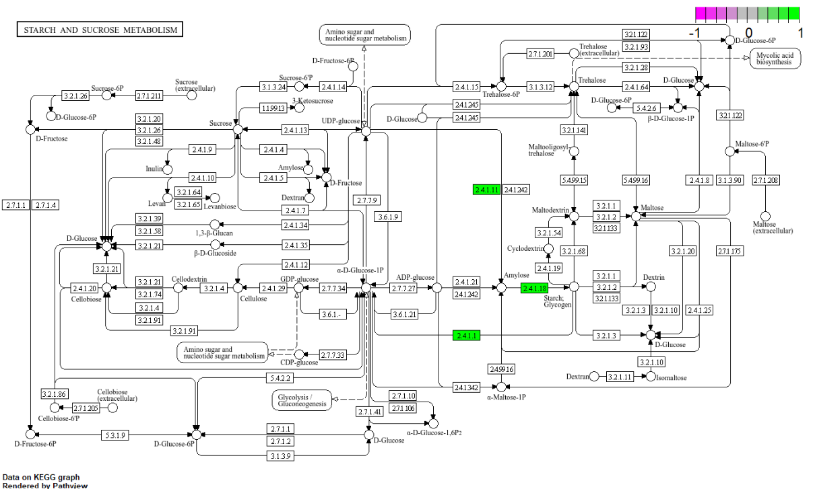

```{r, echo=FALSE}
suppressWarnings(library(knitr))
```

# Abstract

Liver transplantation is a critical treatment for liver failure, but donor shortages have led to the use of expanded criteria donor (ECD) livers, which carry higher risks of complications. Assessing biliary viability, with the purpose of assessing donor liver quality remains challenging. This article explores bile- and liver-based biomarkers associated with biliary viability using a multi-omics approach. Proteomic analysis of samples collected during normothermic machine perfusion (NMP) identified 44 differentially expressed proteins between high- and low-viability groups and one pathway of interest (hsa00500). Key proteins, including MMP7, MUC1, and COPZ1, showed significant changes in abundance, suggesting roles in bile duct function and liver health. Machine learning analysis highlighted SND1 and SNRPD1 as strong classifiers (AUROC \> 0.9), indicating their potential as biomarkers. Transcriptomic data did not reveal significant differences, possibly due to technical limitations. These findings contribute to a better understanding of biliary viability and propose candidate biomarkers for improving donor liver evaluation. Further validation could enhance transplant outcomes by refining organ selection.

# Introduction

Liver transplantation is the first treatment option for patients with liver dysfunctionality (@shen2023role), e.g. in patients with liver cirrhosis or acute liver failure. There is a shortage of donor livers that meet required standards (@Arulraj2011), so now expanded criteria donors (ECD)(@Feng2014) are increasingly used, these consist of livers that do not meet the normally required standards and are often extracted from cardiac death donors (DCD) but also include e.g. elderly donors. Using ECD for liver transplantation can provide a solution for the shortage of liver donors, however, there are also risks associated with ECD livers, such as increased chances of graft failure and death, especially in recipients \< 60 years old and patients with diabetes (@VanIttersum2016). ECD livers are also more susceptible to biliary complications and ischemia-reperfusion injury, which is damage that occurs when an organ lacking oxygen gets reperfused with oxygen again (@shen2023role).

Certain techniques, such as normothermic machine perfusion (NMP) (@Hosgood2011) can reduce the risk of post-transplant complications. NMP attempts to restore and maintain cell metabolism by simulating the natural environment of the liver, by maintaining a temperature of 37 degrees Celsius and providing the organ with the required oxygen and nutrition (@shen2023role). NMP is considered a better alternative to static cold storage (SCS)(@Lee2009), as it reduces the risk of ischemia-reperfusion injury, early allograft dysfunction (EAD), and biliary complications, improving general graft viability (@shen2023role). NMP also allows evaluation of the donor liver pre-transplant, further reducing transplantation risks (@thorne2023bile).

@thorne2023bile describe how NMP is used for assessing organ viability before liver transplantation. Here, the general viability of the organ is divided into two distinct measurements. First, is hepatocellular viability (@Groen2024), which focuses on the metabolic functionality of the parenchyma, or the 'functional tissue' of the liver. The second measurement focuses on biliary viability, which focuses on the state of the cholangiocytes, the epithelial cells of the bile ducts. Biliary viability is measured by analyzing the composition of the bile, including glucose levels and pH (@Groen2024), but as of today, there is no golden standard (@Dingfelder2022), and measurement criteria differ between centers. Biliary viability, unlike hepatocellular viability, is not yet adopted in all clinical trials that work with ECD donor livers; however, it has been shown that the use of both hepatocellular as well as biliary viability in the selection of ECD donors has led to a lower incidence of post-transplant complications affecting cholangiocytes, also known as cholangiopathies (@thorne2023bile).

To gain a more comprehensive understanding of the molecular changes that contribute to biliary viability, a multi-omics approach (@Hasin2017) is employed. Multi-omics integrates data from various biological levels, such as genomics, transcriptomics, metabolomics, and proteomics, to provide a view of complex biological systems, cellular responses, and disease progression. Specifically, this paper leverages a multi-omics strategy to identify bile and liver-based biomarkers that correlate with biliary viability. Biomarkers include various biomolecules that can serve as identifiers for a condition, such as genes, transcripts, and proteins (@Rosati2024). This is achieved by integrating and analyzing data derived from various omics techniques, including principal component analysis (PCA), partial least squares discriminant analysis (PLS-DA), differential expression analysis (DEA)(@Peng2024), and other relevant statistical and bioinformatics analyses to identify differentiating genes and proteins.

We are expecting to find our results comparable to @thorne2023bile, given the shared focus on biliary viability assessments. Since they accessed the viability based partly on 'metabolic functionality' we expect to see upregulations of genes that are part of metabolic pathways in the liver, in livers with high biliary viability. Such as the glycogen production pathway. We also expect to find differentially abundant proteins with functions related to bile production and/or epithelial tissue, as the measured high/low biliary viabilities are based on factors such as bile pH and capacity of epithelial bile duct cells, also known as cholangiocytes.

# Methods

Different proteomics and transcriptomic methods were used to analyze and discover possible biomarkers. The used workflow is presented in the following section.

## Proteomics

For the proteomics analysis, samples collected by @thorne2023bile were used. These samples consist of raw mass spectrometry data obtained from bile samples of donor livers. Samples were taken at different time points during NMP, at 30 minutes, and 150 minutes, and only for livers that ended up being transplanted at the end time point. The proteomics analysis was performed using only the 30- and 150-minute samples, as many low biliary viability samples did not end up being transplanted. In total, there are 43 samples for 150 min and 44 samples for 30 min. These samples have previously undergone protein identification and quantification. The mean percentage of missingness for the features is 42% for the 30 min samples and 56% for the 150 min samples. Samples containing more than 70% missing values were removed, which led to the removal of 2 samples for 150 min (n = 41) and 1 sample for 30 min (n = 43). Features missing in more than 4 samples in at least one of the biliary viability groups were removed. The data is normalized across samples using median centering (@dubois2022normalization), this method is used to center the data over the median of the distribution of each sample. The features were then normalized by 'variance stabilizing transformation' using 'normalize_vsn' of the DEP R-package (v.1.26.0) (@zhang2018proteome), this function uses a robust variant of the maximum-likelihood estimator (@huber2002variance). Missing values in the data were identified to mostly consist of 'missing not at random' values (MNAR)(@Heymans2022), making the missing data left-censored. Thus, imputation was performed using the 'MinDet' function of DEP (v.1.26.0) (@zhang2018proteome), which uses a deterministic minimal value approach. Here all the missing values are replaced with a minimal observed value per sample. Principal component analyses (PCA)(@alma9981496143606533) were performed on the normalized and imputed data using the mdatools (v 0.14.2) package in R (@kucheryavskiy2020mdatools).

Potential biomarker protein evaluation was done using a confusion matrix framework to assess their viability in categorizing livers into high and low biliary viability. The tested thresholds were set in intervals of 0.01 in the range of the expression value of the corresponding potential biomarker protein, and predictive performance was done by calculating accuracy, precision, and AUC-ROC (@fawcett2006introduction) (@bradley1997use) from the resulting confusion matrix. Statistical significance was assessed using Fisher’s exact test (@fisher1932statistical) to confirm whether classification outperformed chance.

Using limma (v.3.60.6) (@ritchie2015limma) a DEA was performed on all features that passed the filtering steps. In this DEA, two distinct groups are compared to each other, the comparison consists of the samples with high biliary viability against samples with low biliary viability. First, a linear model is fitted to each protein. The Empirical Bayes method is applied for smoothing estimates of discrete probabilities and lastly, a false discovery rate correction is applied. After determining which proteins are down/upregulated, a pathway analysis was performed on the 150 min samples, using the found DEPs from the DEA, with the clusterProfiler package (v. 4.12.6)(@yu2012clusterprofiler). The results were visualized using volcano plots and pathview (1.44.0) (@luo2013pathview). Further literature research was performed for all DEPs with a logFC $\geq$ 2 or $\le$ -2.

The supervised discrimination method Partial Least Squares Discriminant Analysis (PLS-DA), based on PLS regression, was applied using the mdatools (version 0.14.2) R package (@kucheryavskiy2020mdatools). Normalized, imputed proteomics data was used as input, with samples classified into high biliary viability and low biliary viability classes. Cross-validation was used to assess the generalization ability of the model and prevent overfitting (@encyclopediaBioinformatics2019), specifically cross-validation with the leave-one-out method. This method used each sample once as a test set while the remaining samples made up the training dataset (@scikit-learn-leaveoneout). The model generated from this was analyzed, and this was done using plots that showed what parameters were important for the model according to weights and variable importance predictions. The components that this model generated were also analyzed and plotted with a scatter plot.

## Transcriptomics

Liver tissue biopsies, stored in the cold, were taken right before the start of the NMP. RNA from these samples was isolated using the Qiagen RNeasy Lipid Tissue Mini Kit. RNA was sequenced using the Illumina NextSeq 500. The resulting reads were trimmed with TrimGalore (v.0.6.7) (@krueger2023trim), and deduplicated with SeqKit (v.2.4.0) (@shen2024seqkit2). They were then mapped with Hisat2 (v2.2.1) (@hisat2) to the human genome h38. The counts were extracted from the resulting files using featureCounts (v.2.0.3) (@liao2014featurecounts). MultiQC (v 1.14) (@ewels2016multiqc) was used to show a comprehensive overview of the quality of multiple FASTQ samples. This generated an HTML report that summarized the results from various QC reports. Showing the combined results across all samples. This report shows if there are potential issues such as adapter contamination or high repeat rates among other possibilities.

RNA-sequencing data was aligned to the GRCh38 (@grch38) using HISAT2 (v 2.2.1) (@kim2019hisat2). HISAT2 was used to build a splice-aware genome index, using the hisat2-build command with default parameters. This build genome index was then used to align the RNA-sequencing FASTQ files. This was done with certain parameters, -U (meaning unpaired FASTQ files), and using the --phred33 score read. The output format from this aligning was a SAM file. All genes with a variance of 0 were removed from the data, this is done to speed up the following analyses and tools. The data was log2 transformed and scaled using R for a PCA. A differential gene expression analysis was performed on the raw count data using the R-package DESeq2 (v.1.38.3) (@love2014deseq2).

## Statistical methods

Differential enrichment analysis (DEA) (@Peng2024) is a method for detecting differences in protein abundance across groups, where the data gets grouped based on certain phenotypes (e.g. disease vs healthy). Resulting from the DEA are differentially enriched proteins (DEPs), which are biomarkers and can be used for constructing phenotype-specific abundance profiles. DEA in proteomics is performed on quantified, normalized, and imputed data, using one of the available tools. The selected tool, limma (@ritchie2015limma) is not designed specifically for proteomics but has proven to perform well in any setting with quantified data and is a popular option for proteomics (@Peng2024). limma uses linear fitting onto each of the features in order to find differences/correlations between conditions. To improve estimates further statistical methods can be applied to the results from limma, in this article, the Empirical Bayes method (@Smyth2004) is applied for smoothing estimates of discrete probabilities, and lastly, a false discovery rate (FDR) correction (@Aggarwal2016) is applied. The FDR correction is based on @Benjamini1995 and corrects p-values for the expected proportion of the features that are falsely found to be statistically significant, as a result of multiple testing.

PCA is used on high-dimensional data. It is a method of reducing the dimensions of data. This is useful for our data since we are looking at the expression of \> 2000 different genes. A PCA works by calculating a covariance matrix, linear correlations, between all of the different variables. One value in this matrix is the linear correlation between 2 variables, or genes in our case. Eigenvectors will be calculated from the variance matrix, these are the directions where the variance of the data is maximized. These values can be used to calculate the loadings, or 'strength', of the variables. These loadings, every component has loadings for all the variables, which can then be projected onto the data. (@alma9981496143606533)

Partial Least Squares Discriminant Analysis (PLS-DA) is a supervised multivariate dimensionality-reduction tool employed to identify complex relationships within high-dimensional datasets. As a variant of Partial Least Squares (PLS) regression, PLS-DA directly utilizes class information to derive components that optimally discriminate between predefined groups (@kucheryavskiy2020mdatools). This method was used to identify biomarkers in the present study. For model validation, cross-validation is crucial to assess the generalization ability of the model and to prevent overfitting (@scikit-learn-leaveoneout). Model quality is quantified by metrics such as R2Y (explained variance in Y ) and Q2 (predictive variance). A permutation test is performed to confirm statistical significance and check for overfitting. Variable Importance in Projection (VIP) scores identify the X-variables most influential in group discrimination, typically with a threshold of VIP \> 1.0. (@encyclopediaBioinformatics2019)

# Results

The results of the analyses and methods to discover biomarkers are presented in the following section. And include the results of the DEA, PCA, PLS-DA and confusion matrix.

## DEA

The DEA on the proteomics samples in total evaluated 2255 features for the 30-min samples and 1610 features for the 150-min samples. For the 30-min samples significantly enriched expressed proteins were found. The 150-min samples contained a total of 44 differentially abundant proteins (Figure 1), details on e.g. p-values and logFC per differentially abundant protein can be found in Table 1. Of these 44 proteins, 13 seem to be less abundant in high biliary viability livers, as opposed to low biliary viability livers. The other 31 proteins are more abundant in biliary viability livers, as opposed to low biliary viability livers. The DEA on the transcriptomics data revealed no significant changes in the abundance of proteins between a high and low biliary viability.

```{r, fig.pos='H', out.width='75%', fig.cap="Volcano plot showing all significantly upregulated- and downregulated proteins in the comparison of high biliary viability against low biliary viability in the samples taken during NMP after 150 minutes. Proteins were deemed as significantly upregulated if the adjusted p-value was \\( \\leq 0.05 \\) and the log\\(_2\\) fold change was \\( \\geq 1.0 \\). Proteins were deemed as significantly downregulated if the adjusted p-value was \\( \\leq 0.05 \\) and the log\\(_2\\) fold change was \\( \\leq -1.0 \\).", echo=FALSE}

knitr::include_graphics("img/DEG_150min.png")
```

One statistically significant (p-adj: $\le$ 0.05) pathway was found in the pathway analysis (Figure 2), hsa00500 which is a pathway involved in the metabolism of starch and sucrose. A total of 4 annotated DEPs correspond with enzymes in this pathway, these DEPs include GBE1, PYGL, AGL, and GYS2. AGL and PYGL correspond with 2.4.1.1, GYS2 with 2.4.1.11, and GBE1 with 2.4.1.18. The RichFactor of this pathway is 0.1, meaning that 10% of the total genes in that pathway correspond with one of the DEPs. The FoldEnrichment is 26.82, meaning that the frequency of all the annotated genes is 26.82 times higher in the high biliary viability group than in the low biliary viability group. 

```{r, fig.pos='H', out.width='95%', fig.cap="hsa00500 KEGG pathway, involved in starch and sucrose metabolism. The colored squares show differentially enriched proteins (green = upregulated, purple = downregulated).", echo=FALSE}

```

## PCA

Figure 3 shows that the group with low biliary viability is less spread throughout the second component. Samples with a high biliary viability show to have a higher spread over the second component compared to the samples with low viability. 3 samples with a high biliary viability and 1 sample with a low biliary viability cause a high variance in the first component. A perfect linear separation of the 2 groups is not possible. The first and second component explain 16.4% and 10.5% of the total variance, respectively.

From the PCA that was performed on the 150-minute samples (Figure 4), it becomes clear that there appears to be more of a separation between the 2 groups, compared to Figure 3. Still, there does not appear to be any clear clustering between the groups, only with a couple of samples. The first and second component explain 20.8% and 11.6% of the total variance, respectively.

```{r, fig.pos='H', out.width='75%', fig.cap="PCA performed on proteomic samples 30 minutes after starting NMP.  Shows how the samples are spread over component 1 and component 2. Biliary viability is displayed with color.", echo=FALSE}
knitr::include_graphics("img/pca30.png")
```

```{r, fig.pos='H', out.width='75%', fig.cap="PCA performed on proteomic samples 150 minutes after starting NMP.  Shows how the samples are spread over component 1 and component 2. Biliary viability is displayed with color.", echo=FALSE}
knitr::include_graphics("img/pca150.png")
```

## PLS-DA

PLS-DA was performed on the normalized, imputed proteomics data. This data was then split into two groups, high biliary viability and low biliary viability. Figure 5 shows the loadings of the most important component. This displays all proteins that have a contribution above 8. Figure 6 shows the comparison between the 1st and 3rd component. The 1st component contains 82.43% of the information of the original data. Component 3 contains 2.06% of the information of the original data. This comparison was the only one that showed 2 groups, this divide is shown by the line.

```{r, fig.pos='H', fig.cap="Contribution of proteins to Component 1 in the PLS-DA model. The bar plot displays the loadings of the individual proteins on the first component. The proteins were filtered with a minimum of contribution above 8. This was done to show a clear overview of the most influential proteins. Proteins with larger absolute loadings are more influential in defining the variation captured by Component 1 and thus contribute significantly to the group separation observed in the PLS-DA score plot.", echo=FALSE, out.width="75%"}

```

```{r, fig.pos='H', out.width='75%', fig.cap="PLS-DA Score plot showing component 1 – component 3, performed on the proteomic samples at 150 min after starting NMP. Showing how the samples are laid out over components 1 and 3. Viability is shown with color. A line has been drawn to show the 2 groups that were formed.", echo=FALSE}

```

## Confusion Matrix

To identify proteins and thresholds with potential as biomarkers, we filtered the dataset using a p-value cut-off of 0.05. This evaluation was performed on the 150-minute time point dataset, as no proteins-threshold combination met this minimum p-value requirement at the 30-minute time point. From the filtered 150-minute dataset, 14 unique thresholds were identified where proteins demonstrated statistically significant p-values ($\le$ 0.05)(Table 2). These protein-threshold combinations correspond to optimal expression cut-offs used to classify samples based on protein abundance.

Among the protein-thresholds combinations meeting the significance criteria, SND1 and SNRPD1 consistently appeared at multiple thresholds. Both proteins demonstrated high classification metrics across these thresholds, indicating significant categorization performance ability. Specifically, SND1 achieved the highest area under the receiver operating characteristic curve (AUROC) of 0.95 indicating a high ability to distinguish between sample classes. It was observed at two thresholds: 13.89 and 13.79, with precision values of 0.67 and 0.75, and accuracy values of 0.85 and 0.89, respectively. The specificity for both thresholds was perfect (1.0), with zero false positive rates. Similarly, SNRPD1 was found at three thresholds (13.72, 13.62, and 13.52), reaching a maximum AUROC of 0.933. Precision ranged from 0.75 to 0.83, while accuracy improved from 0.89 to 0.93 across these thresholds. Specificity remained at 1.0 with zero false positive rates. The protein HSD17B13 was observed with a statistically significant p-value and showed moderate performance metrics, including an AUROC of 0.775, precision of 0.67, and accuracy of 0.85.

In contrast are the proteins ACE2, MMP7, and PUF60. Although they met the p-value criteria, they demonstrated notably lower classification performance. These proteins showed AUROC values below 0.7 (approximately 0.65–0.66), despite high precision values (0.93). However, their specificity was significantly lower (0.44), resulting in high false positive rates (approximately 0.56).


# Discussion/Conclusion

The earlier discussed results are interpreted in this section, the identified proteins are further elaborated on what their function is, how they relate to liver- and or bile duct health, and how they could be a biomarker for biliary viability. Technical limitations, leading to a lack of data and thus a lack of results are also discussed.

Protein abundances were compared in a DEA between two groups and two timepoints, with low against high biliary viability at timepoint 30 minutes and at timepoint 150 minutes. Resulting from this was the identification of 44 statistically significant and differentially enriched potential biomarker proteins ($p-adjust \le 0.05$ & $log2FC \geq 1.0 \lor log2FC \le -1.0$ ) (Table 1). These biomarkers have a logFC range of -2.60 to 2.08 for the comparison of high biliary viability against a reference of low biliary viability. This means any protein with a positive logFC is more abundant in high biliary viability livers, and a negative logFC means the protein is more abundant in low biliary viability livers. A further literature search was performed for all found proteins with a $logFC \geq 2.0 \lor logFC \le -2.0$, corresponding to a fold change of 4. This results in 5 proteins that are more abundant in low biliary viability livers, including: MMP7 (logFC: -2.60, p-adj: 7.49e-03), MUC1 (logFC: -2.49, p-adj: 7.81e-03), PGC (logFC: -2.32, p-adj: 3.35e-02), ACE2 (logFC: -2.23, p-adj: 7.49e-03) and ABCG5 (logFC: -2.08, p-adj: 3.53e-02), and 1 protein that is more abundant in high biliary viability livers, which is COPZ1 (logFC: 2.08, p-adj: 3.83e-02).

MMP7 (matrix metallopeptidase 7) is part of a family of enzymes responsible for the breakdown of extracellular matrix proteins (@kumara2021plasma). MMP7 has been found to contribute to the pathogenesis of bile duct epithelial injury (@Allam2024) and was also highlighted in our PLS-DA. MUC1 (Mucin 1) is a mucin family member that is associated with cell signaling and proliferation pathways and expression of MUC1 is predominantly found in cholangiocytes (@thorne2023bile). MUC1 function differs in normal cells as opposed to cancer cells, in normal cells, it acts as a lubricant but in cancer cells, overexpression of MUC1 can occur, leading to aberrant glycosylation (@chen2021muc1). MUC1 is also expressed in the liver and it has been found to be overexpressed during the carcinogenesis of hepatobiliary cancers (@kasprzak2019mucins). MUC1 was found in our PLS-DA analysis, here it was found to be a significant variable that allows for differentiating between biliary viability groups. PGC (Progastricsin) in enriched abundance plays a role in tumorigenesis of hepatocellular carcinoma (@chen2019overexpressed). ACE2 (Angiotensin-converting enzyme 2) is a receptor that is involved in allowing viral entry into host cells, including members of the SARS-CoV group (@pirola2020covid19). ABCG5 (ATP-binding cassette sub-family G member 5) is needed for transporting cholesterols into bile, @yu2002abcg5 found that expression of ABCG5 increased biliary cholesterol concentrations. Increased cholesterol concentrations can lead to cholesterol supersaturation, which can cause the formation of gallstones (@dikkers2010biliary). Noticeably all of the 5 proteins with increased abundance in low liver viability, can be linked to (liver) disease, this signifies that they are interesting candidates for further investigation as potential biomarkers. 

COPZ1 (COPI Coat Complex Subunit Zeta 1) encodes for a subunit of the cytoplasmic coatamer protein complex, this complex is involved in protein transport and autophagy (@copz1_gene). COPZ1 was found to be overexpressed in high biliary viability livers, but interestingly this COPZ1 was also found overexpressed in multiple types of cancer, including cholangiocarcinoma and liver hepatocellular cancer (@hong2023comprehensive). This protein is a prognostic marker in liver hepatocellular carcinoma and plays an essential role in maintaining the survival of a variety of tumor types (@hong2023copz1). COPZ1 was also identified as an important variable for differentiating between the biliary viability groups in our PLS-DA analysis.

The found DEPs were used for further downstream pathway analysis. One pathway was found, hsa00500, a pathway involved in the metabolism of starch and sucrose. The enriched proteins found in this pathway are GBE1, PYGL, AGL, and GYS2. PYGL (liver glycogen phosphorylase) and AGL (Glycogen Debranching Enzyme) are enzymes that catalyze the degradation of glycogen, which, in the liver, serves as a source for glucose in order to maintain homeostasis of the blood glucose between meals (@Agius2015). PYGL deficiency, which can be caused by the downregulation of PYGL, results in the accumulation of hepatic glycogen, as less degradation will be catalyzed. This can lead to an increased risk of liver fibrosis, liver damage, and inflammation (@Wilson2019), which corresponds to the findings of the downregulation of PYGL in the starch and sucrose metabolism pathway. Downregulation of AGL shows similar findings, as AGL and PYGL are involved in the same degradation process of glycogen and has been thought to cause accumulation of abnormal glycogen in the liver (@adevaandany2016glycogen). GBE1 (glycogen branching enzyme) is involved in the branching of glycogen, the branched structure proves important because it improves solubility and allows more efficient synthesis and degradation of glycogen (@malinska2020oxidative). @malinska2020oxidative have found that a decrease in branching of glycogen has an impact on cellular homeostasis, leading to increased oxidative stress which can contribute to the formation of various diseases. GYS2 (Glycogen Synthase 2) is an enzyme that synthesizes glycogen, specifically a liver isoform of glycogen (@irimia2017lack). GYS2 has been shown to have a role in biliary health, as downregulation of GYS2 promotes cholangiocarcinoma cells in actions such as proliferation and migration (@a2021value). hsa00500 proves to be an interesting subject for further examination, as all included proteins seem to play a role in either hepatic- or biliary viability.

Analyzing the loadings of the PLS-DA (Figure 5) led to the identification of two other significant proteins with liver functions that were not found in the DEA, which include ABCC2 and ABCB11. ABCC2, also known as the Multidrug Resistance Protein 2, is involved in the transport of substances out of cells. It plays a crucial role in drug disposition, by mediating ATP-dependent efflux of a wide range of compounds, including drug metabolites, from cells into bile or urine. (@devgun2012abcc2) (@jedlitschky2006mrp2) (@machida2005mrp2) (@vanderschoor2015abcc2abcc3) . ABCC2's transport of bilirubin out of the liver cells and into the bile is particularly relevant. Bilirubin is a substance that is produced during the breakdown of old red blood cells and is frequently used to check the health of a patient's liver. This is done with a multitude of bilirubin tests, checks of hyperbilirubinemia shows alterations in liver and bile and i a long-established marker that is of prognostic value in different liver diseases.; therefore, the identification of ABCC2 as an important potential biomarker for biliary viability.( @guerra2021bilirubin). ABCB11, also known as the Bile Salt Export Pump (BSEP). BSEP is responsible for the ATP-dependent transport of primary hydrophobic bile salts, such as taurine and glycine-conjugated cholic acid, from hepatocytes into the bile (@uniprot_O95342). This process is fundamental for hepatic bile acid homeostasis and, consequently, for lipid homeostasis through the regulation of biliary lipid secretion. Dysregulation or dysfunction of BSEP can lead to severe cholestatic liver injury (@byrne2002_bsep), as observed in conditions like Progressive Familial Intrahepatic Cholestasis Type 2 (PFIC2), where biallelic mutations in ABCB11 cause an accumulation of hepatic bile acids and subsequent hepatotoxicity, ultimately leading to liver failure (@gruget2025bsep). Given BSEP's critical role in bile acid transport, it's an important protein for evaluating biliary viability and, therefore a significant biomarker. The reason these 2 proteins have been chosen over the highest contributing proteins is because of their affinity with the liver.

Some of our findings of our DEA and PLS-DA overlap with what @thorne2023bile have found. @thorne2023bile identified three proteins with significant differences between biliary viability groups; MUC5B, MUC1, and LCN2. We have been able to reinforce two of these findings, MUC1 (logFC: -2.49, p-adj: 7.81e-03) and LCN2 (p-adjust: 4.38x10-4, logFC: 1.44). LCN2 (Lipocalin-2) has been found to contribute to liver fibrosis and hypertension of the portal vein (@chen2020lcn2). MUC5B was not found to show significant differences between biliary viability groups in our research.

The DEA analysis on the transcriptomics data showed no significant differences between the high and low biliary viability. This could be due to issues with the used data. We were able to download the RNA data in 2 different file formats: paired FASTQ files and BAM files. It appeared, after running feature counts on the BAM files, that these were not aligned to a reference genome. This was very unusual, BAM-files are supposed to be mapped to a reference genome. So, the FASTQ files were used to extract the counts. A new issue showed up, the alignment rate of these FASTQ files was very low (30%). Checking the quality revealed that, at random, either the reverse or forward file for every sample contained reads with a length of 6 base pairs. These reads were not used by the aligner, which caused it to have a very low alignment rate. These issues could explain why we didn’t find any significant changes between high and low variability.

In Figure 6, two groups are shown divided by the line. However, two low biliary viability livers appeared to be misclassified as having high biliary viability; this possibly suggests that these livers could have unique characteristics. This group formation could also imply that proteins driving the separation are biologically relevant, and analyzing these livers could provide valuable insights into the mechanisms that differentiate between the high and low classifications. By identifying the key variables that cause the most separation, a deeper understanding can be gained of what molecular drivers distinguish these groups and facilitate a more accurate assessment of biliary viability.

MinDet was chosen as the imputation method as it is a deterministic minimal value approach, meaning all missing values are replaced with the lowest observed value per sample. This method was chosen as it ensures reproducibility because it is not a stochastic method and it is also fitting for our data, which is left-censored with many missing not-at-random (MNAR) values. MNAR values are missing values that are caused by low peptide intensity signals, meaning the intensities are below the instrumental detection limit (@shi2025imputation). However, the data also, to a lesser extent, contains missing completely at random (MCAR) values, which occur independently of peptide abundance. MAR values can occur at any intensity, unlike MNAR values and thus imputing these values using the lowest found value is not optimal. However, as there were a lot more MNAR values, it was still decided to use MinDet. Still, it should be noted that this imputation method can skew results to the left, towards lower values, which can affect outcomes. The principal component analyses revealed no clear separation between low and high biliary viability. This could be a result of the chosen imputation method, which could have caused a lower variance between the high and low biliary viability samples.

The confusion matrix based binary classification analysis found several proteins with statistically significant categorization performance based on p-values $\le$ 0.05, evaluated across several expression thresholds. The results displayed are only sourced from the 150 min samples due to the fact that the 30 min samples contained no proteins with p-values $\le$ 0.05. Proteins such as SND1, SNRPD1, COPG1, and COPG2 consistently demonstrated strong classification performance, with perfect specificity and zero false positive rates. SND1 achieved the highest AUROC value, while SNRPD1 reached a close to maximum AUROC value. These high AUROC values, combined with the respective high precision up to almost maximal accuracy, indicate very high classification performance. These metrics are particularly important in biomedical applications where high specificity and low false positive rates are critical to avoid incorrect classification because of the consequences of failure. In contrast, ACE2, MMP7, and PUF60 also met the statistical significance threshold but displayed lower AUROC values. Specifically, all below 0.7, or the line of adequacy. Despite this, they exhibited high precision and moderate accuracy. However, their specificity was low and the false positive rate high. This combination suggests a potential imbalance in classification outcomes. While high precision and accuracy might indicate some use in categorization, the low AUROC implies that these proteins do not consistently perform well across the range of decision thresholds. AUROC remains a more comprehensive measure of model performance, capturing both sensitivity and specificity over all possible thresholds. Therefore, low AUROC values point to limited generalizability and shed doubt on the reliability of these proteins as classifiers in larger- and or other datasets, despite their statistical significance. The appearance of multiple significant thresholds for proteins like SND1 and SNRPD1 further highlights their potential. Their ability to classify consistently across varying cut-off values reflects a robustness that is desirable in practical applications, where expression levels can vary across individuals and experimental conditions. These results emphasize the importance of evaluating multiple performance metrics when assessing biomarker candidates. While statistical significance is a necessary starting point, it is not sufficient on its own. Metrics such as AUROC, specificity, and false positive rate provide crucial context for determining the practical utility of a given protein in classification tasks. The combination of high AUROC, consistent performance across thresholds, and perfect specificity makes proteins like SND1 and SNRPD1 strong candidates for further investigation.

In this article we have presented novel proteins and a pathway that could be used as biomarkers in the differentiation between ECD-donor livers with high- and low biliary viability, which brings us closer to being able to develop biomarker profiles for biliary viability levels allowing for more structural analysis of biliary viability in ECD-donor livers, potentially enlarging the donor pool. Further research is needed to validate the relationships between these proteins of interest and biliary viability.

# Appendix
```{r, echo=FALSE}
load("../../proteomics/paper_tables/diff_expressed_genes_table_150min.Rdata")

knitr::kable(diff_expressed_genes_150min, format="latex")
```

Table 1. All found differentially expressed proteins in the comparison between high- and low billiary viability livers after 150 minutes of NMP, with information on certain statistics such as p-values.

```{r, echo=FALSE}
load("../../proteomics/paper_tables/extra_rounded_significant_150_min_result.Rdata")

knitr::kable(extra_rounded_sig_150_results, format="latex", row.names=FALSE)
```

Table 2. Identified significant protein-threshold combinations in the 150-minute time point dataset.


# References
